# CollabBoard Architecture Document

## Overview

This document describes the technical architecture of CollabBoard, a real-time collaborative whiteboard application. The architecture is designed following SOLID principles and modular design patterns to ensure maintainability, testability, and extensibility.

---

## Table of Contents

1. [System Architecture](#1-system-architecture)
2. [Module Structure](#2-module-structure)
3. [SOLID Principles Implementation](#3-solid-principles-implementation)
4. [Data Flow Patterns](#4-data-flow-patterns)
5. [Interface Definitions](#5-interface-definitions)
6. [Service Layer Architecture](#6-service-layer-architecture)
7. [Component Architecture](#7-component-architecture)
8. [State Management](#8-state-management)
9. [Real-Time Synchronization](#9-real-time-synchronization)
10. [AI Integration Architecture](#10-ai-integration-architecture)

---

## 1. System Architecture

### 1.1 High-Level Overview

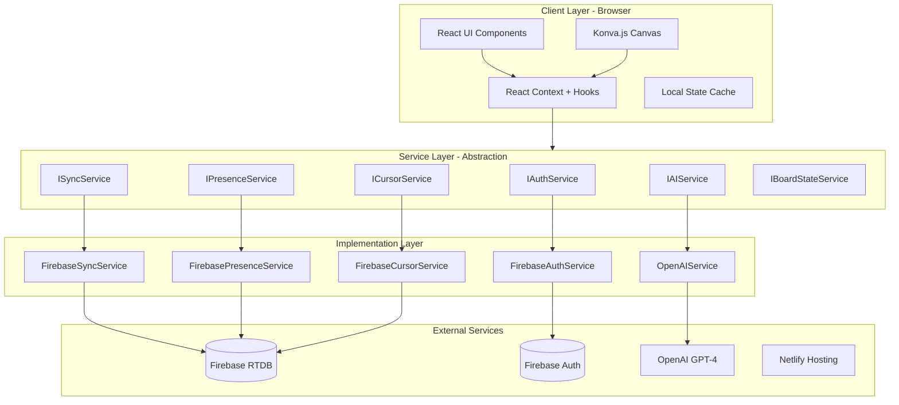

### 1.2 Technology Stack Layers

| Layer | Technology | Responsibility |
|-------|------------|----------------|
| **Presentation** | React + Konva.js | UI rendering, user interactions |
| **State** | React Context + Hooks | Application state management |
| **Service** | TypeScript Interfaces | Business logic abstraction |
| **Implementation** | Firebase SDK, OpenAI SDK | External service integration |
| **Infrastructure** | Netlify, Firebase | Hosting, database, authentication |

---

## 2. Module Structure

### 2.1 Directory Architecture

```
src/
├── auth/                           # Authentication Module
│   ├── interfaces/
│   │   └── IAuthService.ts         # Auth contract
│   ├── services/
│   │   └── FirebaseAuthService.ts  # Firebase implementation
│   ├── hooks/
│   │   └── useAuth.ts              # Auth React hook
│   ├── components/
│   │   ├── LoginComponent.tsx
│   │   ├── SignupComponent.tsx
│   │   └── AuthGuard.tsx
│   ├── context/
│   │   └── AuthContext.tsx
│   └── index.ts                    # Public exports
│
├── board/                          # Board Canvas Module
│   ├── interfaces/
│   │   ├── IBoardObject.ts         # Base object contract
│   │   ├── IBoardState.ts          # State contract
│   │   ├── ITransformable.ts       # Transform capability
│   │   ├── IEditable.ts            # Edit capability
│   │   ├── ISelectable.ts          # Selection capability
│   │   └── IColorable.ts           # Color capability
│   ├── objects/
│   │   ├── StickyNote.ts
│   │   ├── Shape.ts
│   │   ├── Rectangle.ts
│   │   ├── Circle.ts
│   │   ├── Line.ts
│   │   ├── Connector.ts
│   │   ├── Frame.ts
│   │   └── ObjectFactory.ts        # Factory pattern
│   ├── services/
│   │   ├── BoardStateService.ts
│   │   └── SelectionService.ts
│   ├── hooks/
│   │   ├── useBoardState.ts
│   │   └── useSelection.ts
│   ├── components/
│   │   ├── BoardCanvasComponent.tsx
│   │   ├── StickyNoteComponent.tsx
│   │   ├── ShapeComponent.tsx
│   │   ├── ConnectorComponent.tsx
│   │   ├── ToolbarComponent.tsx
│   │   └── ZoomControlsComponent.tsx
│   ├── context/
│   │   └── BoardContext.tsx
│   └── index.ts
│
├── sync/                           # Real-Time Sync Module
│   ├── interfaces/
│   │   └── ISyncService.ts
│   ├── services/
│   │   └── FirebaseSyncService.ts
│   ├── hooks/
│   │   └── useBoardSync.ts
│   ├── utils/
│   │   ├── optimisticUpdate.ts
│   │   └── conflictResolution.ts
│   └── index.ts
│
├── presence/                       # User Presence Module
│   ├── interfaces/
│   │   ├── IPresenceService.ts
│   │   └── ICursorService.ts
│   ├── services/
│   │   ├── FirebasePresenceService.ts
│   │   └── FirebaseCursorService.ts
│   ├── hooks/
│   │   ├── usePresence.ts
│   │   └── useCursors.ts
│   ├── components/
│   │   ├── PresenceListComponent.tsx
│   │   ├── CursorOverlayComponent.tsx
│   │   └── UserAvatarComponent.tsx
│   ├── context/
│   │   └── PresenceContext.tsx
│   └── index.ts
│
├── ai/                             # AI Agent Module
│   ├── interfaces/
│   │   └── IAIService.ts
│   ├── services/
│   │   └── OpenAIService.ts
│   ├── tools/
│   │   ├── schemas/
│   │   │   ├── createStickyNote.ts
│   │   │   ├── createShape.ts
│   │   │   ├── moveObjects.ts
│   │   │   └── ...
│   │   ├── executors/
│   │   │   └── ToolExecutor.ts
│   │   └── AITools.ts
│   ├── hooks/
│   │   └── useAICommands.ts
│   ├── components/
│   │   ├── AICommandBarComponent.tsx
│   │   └── AIStatusIndicator.tsx
│   ├── context/
│   │   └── AIContext.tsx
│   └── index.ts
│
└── shared/                         # Shared Utilities
    ├── config/
    │   ├── firebase.ts
    │   └── environment.ts
    ├── types/
    │   ├── common.ts
    │   └── events.ts
    ├── utils/
    │   ├── debounce.ts
    │   ├── throttle.ts
    │   ├── uuid.ts
    │   └── coordinates.ts
    ├── hooks/
    │   └── useEventListener.ts
    └── index.ts
```

### 2.2 Module Dependency Graph

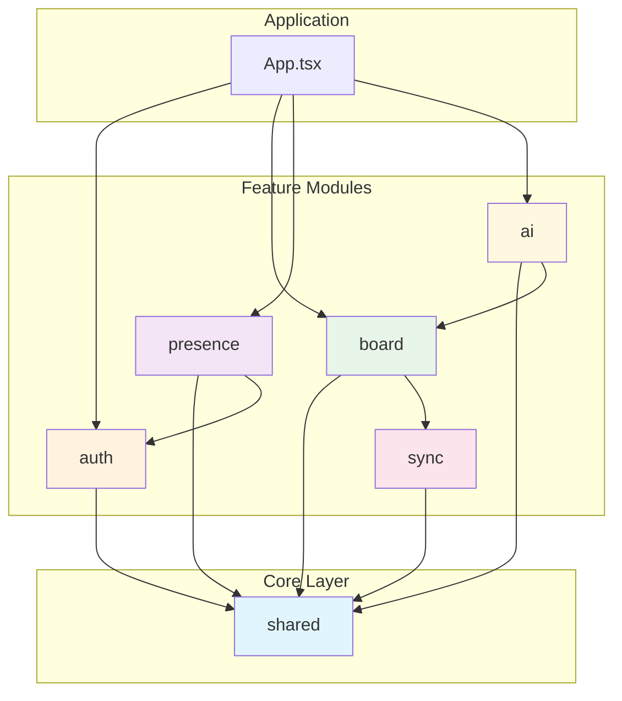

### 2.3 Module Boundaries and Exports

Each module exposes only its public API through `index.ts`:

```typescript
/** src/auth/index.ts */
export type { IAuthService, User, AuthStateCallback } from './interfaces/IAuthService';
export { FirebaseAuthService } from './services/FirebaseAuthService';
export { useAuth } from './hooks/useAuth';
export { AuthProvider, AuthContext } from './context/AuthContext';
export { LoginComponent } from './components/LoginComponent';
export { AuthGuard } from './components/AuthGuard';
```

---

## 3. SOLID Principles Implementation

### 3.1 Single Responsibility Principle (SRP)

Each class/service has exactly one reason to change:

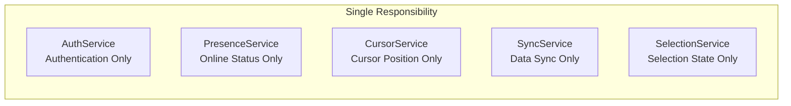

**Example Implementation:**

```typescript
/**
 * AuthService handles ONLY authentication.
 * Presence is handled by PresenceService.
 * Cursors are handled by CursorService.
 */
class FirebaseAuthService implements IAuthService {
  async signIn(email: string, password: string): Promise<User> {
    // ONLY handles sign-in logic
  }
  
  async signOut(): Promise<void> {
    // ONLY handles sign-out logic
    // Does NOT handle presence cleanup (PresenceService does that)
  }
}
```

### 3.2 Open/Closed Principle (OCP)

The system is open for extension but closed for modification:

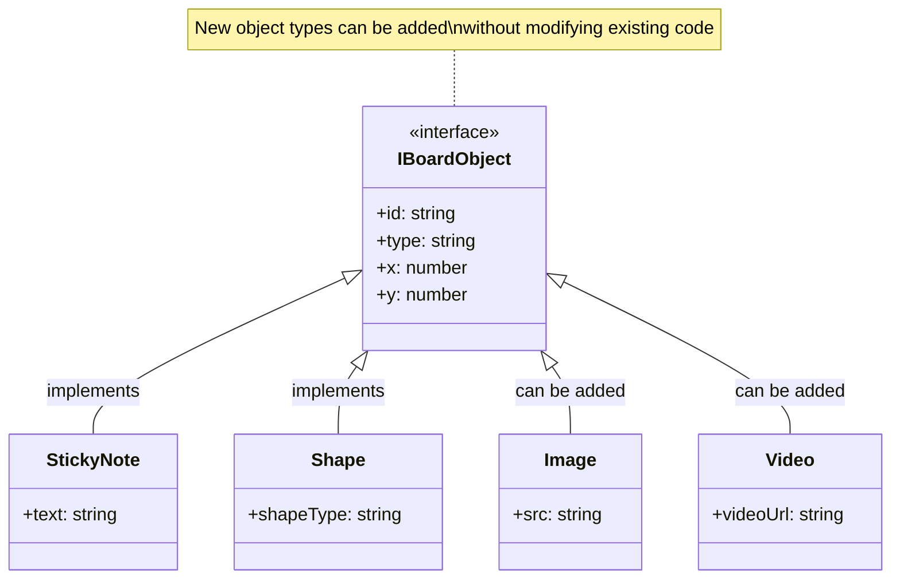

**Factory Pattern for Extension:**

```typescript
class ObjectFactory {
  private creators = new Map<string, ObjectCreator>();
  
  /** Register new object types at runtime */
  register(type: string, creator: ObjectCreator): void {
    this.creators.set(type, creator);
  }
  
  /** Create objects without knowing concrete types */
  create(type: string, props: Partial<IBoardObject>): IBoardObject {
    const creator = this.creators.get(type);
    if (!creator) throw new Error(`Unknown type: ${type}`);
    return creator(props);
  }
}

// Registration at startup
factory.register('sticky-note', (props) => new StickyNote(props));
factory.register('rectangle', (props) => new Rectangle(props));
// New types can be added without modifying factory
factory.register('image', (props) => new ImageObject(props));
```

### 3.3 Liskov Substitution Principle (LSP)

All implementations are substitutable for their base interfaces:

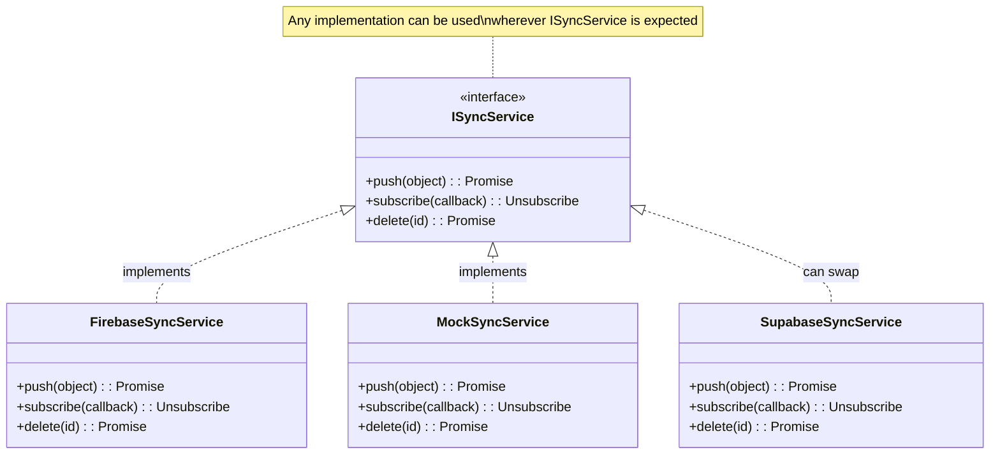

**Usage Example:**

```typescript
/** Component depends on interface, not implementation */
interface BoardProps {
  syncService: ISyncService;  // Any implementation works
}

function BoardCanvas({ syncService }: BoardProps) {
  // Works with FirebaseSyncService, MockSyncService, etc.
  useEffect(() => {
    return syncService.subscribe((objects) => {
      setObjects(objects);
    });
  }, [syncService]);
}

// Production
<BoardCanvas syncService={new FirebaseSyncService()} />

// Testing
<BoardCanvas syncService={new MockSyncService()} />
```

### 3.4 Interface Segregation Principle (ISP)

Small, focused interfaces instead of large monolithic ones:

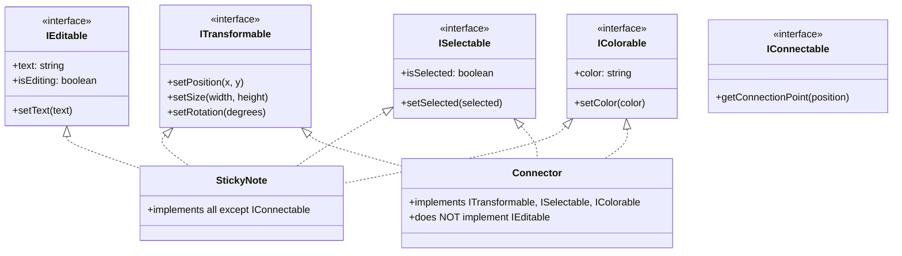

**Implementation:**

```typescript
/** StickyNote implements only what it needs */
class StickyNote implements 
  IBoardObject, 
  ITransformable, 
  IEditable, 
  ISelectable, 
  IColorable 
{
  // Does NOT implement IConnectable
  // because sticky notes aren't connector endpoints
}

/** Connector implements only what it needs */
class Connector implements 
  IBoardObject, 
  ITransformable, 
  ISelectable, 
  IColorable 
{
  // Does NOT implement IEditable
  // because connectors don't have editable text
}
```

### 3.5 Dependency Inversion Principle (DIP)

High-level modules depend on abstractions, not concretions:

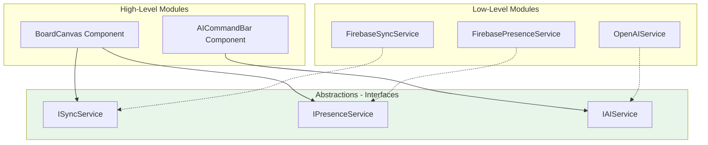

**Dependency Injection Container:**

```typescript
interface ServiceContainer {
  authService: IAuthService;
  syncService: ISyncService;
  presenceService: IPresenceService;
  cursorService: ICursorService;
  aiService: IAIService;
}

/** Factory creates appropriate implementations */
function createProductionServices(): ServiceContainer {
  return {
    authService: new FirebaseAuthService(),
    syncService: new FirebaseSyncService(),
    presenceService: new FirebasePresenceService(),
    cursorService: new FirebaseCursorService(),
    aiService: new OpenAIService(),
  };
}

function createTestServices(): ServiceContainer {
  return {
    authService: new MockAuthService(),
    syncService: new MockSyncService(),
    presenceService: new MockPresenceService(),
    cursorService: new MockCursorService(),
    aiService: new MockAIService(),
  };
}

/** Provider injects services into component tree */
function ServiceProvider({ children, services }: Props) {
  return (
    <ServiceContext.Provider value={services}>
      {children}
    </ServiceContext.Provider>
  );
}
```

---

## 4. Data Flow Patterns

### 4.1 Unidirectional Data Flow

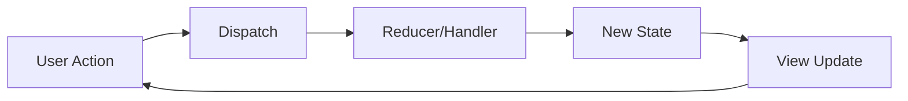

### 4.2 Optimistic Update Pattern

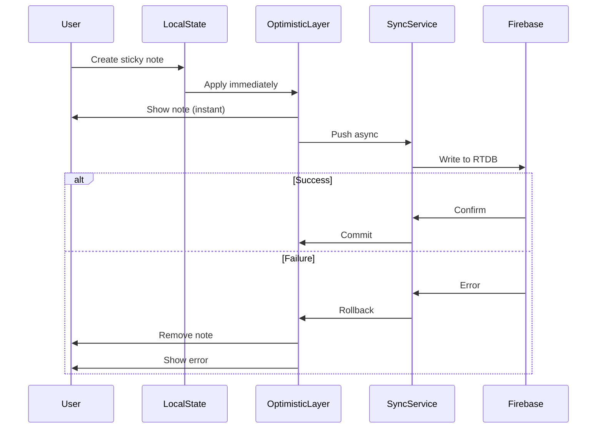

### 4.3 Real-Time Subscription Flow

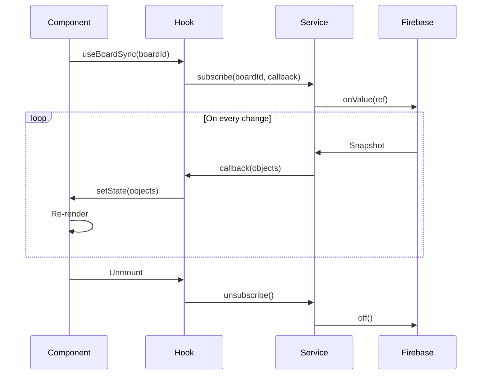

---

## 5. Interface Definitions

### 5.1 Core Interfaces

```typescript
/** Base board object interface */
interface IBoardObject {
  readonly id: string;
  readonly type: string;
  x: number;
  y: number;
  width: number;
  height: number;
  color: string;
  rotation: number;
  readonly createdAt: number;
  updatedAt: number;
}

/** Board state interface */
interface IBoardState {
  objects: Map<string, IBoardObject>;
  viewportX: number;
  viewportY: number;
  scale: number;
  selectedIds: Set<string>;
}

/** Capability interfaces */
interface ITransformable {
  setPosition(x: number, y: number): void;
  setSize(width: number, height: number): void;
  setRotation(degrees: number): void;
}

interface IEditable {
  text: string;
  setText(text: string): void;
  isEditing: boolean;
  setEditing(editing: boolean): void;
}

interface ISelectable {
  isSelected: boolean;
  setSelected(selected: boolean): void;
}

interface IColorable {
  color: string;
  setColor(color: string): void;
}
```

### 5.2 Service Interfaces

```typescript
/** Authentication service */
interface IAuthService {
  signIn(email: string, password: string): Promise<User>;
  signUp(email: string, password: string): Promise<User>;
  signOut(): Promise<void>;
  getCurrentUser(): User | null;
  onAuthStateChanged(callback: AuthStateCallback): Unsubscribe;
}

/** Synchronization service */
interface ISyncService {
  push(object: IBoardObject): Promise<void>;
  pushBatch(objects: IBoardObject[]): Promise<void>;
  subscribe(boardId: string, callback: SyncCallback): Unsubscribe;
  delete(objectId: string): Promise<void>;
  deleteBatch(objectIds: string[]): Promise<void>;
}

/** Presence service */
interface IPresenceService {
  setOnline(userId: string, displayName: string): Promise<void>;
  setOffline(userId: string): Promise<void>;
  subscribeToPresence(boardId: string, callback: PresenceCallback): Unsubscribe;
  getOnlineUsers(boardId: string): Promise<OnlineUser[]>;
}

/** Cursor service */
interface ICursorService {
  updatePosition(userId: string, x: number, y: number): Promise<void>;
  subscribeToAllCursors(boardId: string, callback: CursorCallback): Unsubscribe;
  removeCursor(userId: string): Promise<void>;
}

/** AI service */
interface IAIService {
  processCommand(command: string, boardState: IBoardObject[]): Promise<ToolCall[]>;
  executeTool(toolCall: ToolCall, boardService: IBoardStateService): Promise<void>;
  getAvailableTools(): ToolDefinition[];
}
```

---

## 6. Service Layer Architecture

### 6.1 Service Hierarchy

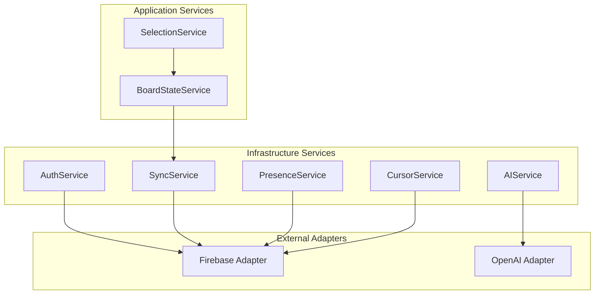

### 6.2 Service Lifecycle

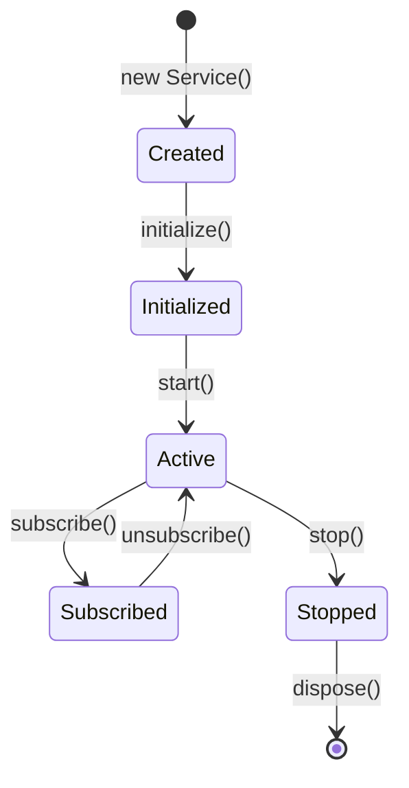

---

## 7. Component Architecture

### 7.1 Component Hierarchy

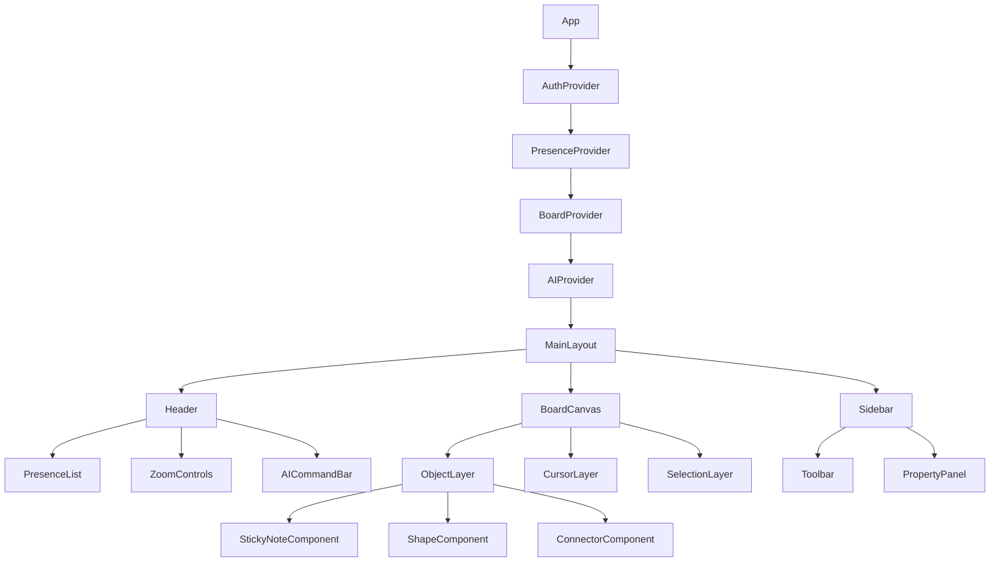

### 7.2 Component Responsibilities

| Component | Responsibility |
|-----------|----------------|
| `App` | Root component, provider composition |
| `AuthProvider` | Authentication context |
| `BoardProvider` | Board state context |
| `PresenceProvider` | Presence/cursor context |
| `AIProvider` | AI service context |
| `BoardCanvas` | Konva stage management |
| `ObjectLayer` | Object rendering |
| `CursorLayer` | Remote cursor rendering |
| `Toolbar` | Tool selection UI |

---

## 8. State Management

### 8.1 State Architecture

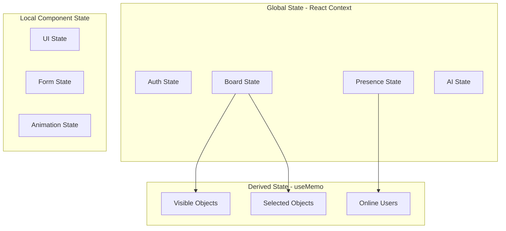

### 8.2 State Flow

```typescript
/** Board State Structure */
interface BoardStateContextValue {
  // State
  objects: Map<string, IBoardObject>;
  selectedIds: Set<string>;
  viewportX: number;
  viewportY: number;
  scale: number;
  
  // Actions
  addObject(object: IBoardObject): void;
  updateObject(id: string, updates: Partial<IBoardObject>): void;
  deleteObject(id: string): void;
  selectObject(id: string, additive?: boolean): void;
  clearSelection(): void;
  setViewport(x: number, y: number, scale: number): void;
}
```

---

## 9. Real-Time Synchronization

### 9.1 Sync Architecture

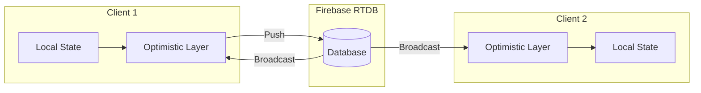

### 9.2 Conflict Resolution

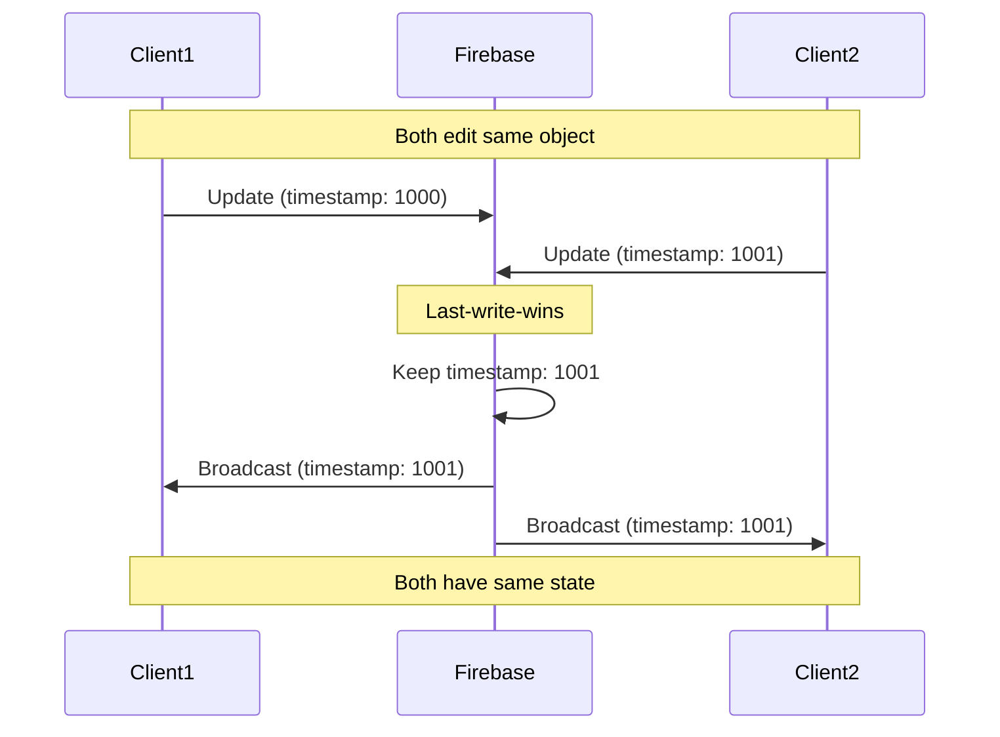

### 9.3 Offline Support

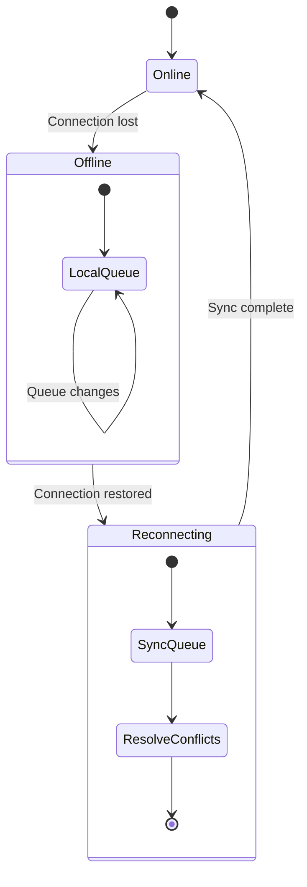

---

## 10. AI Integration Architecture

### 10.1 AI Command Processing

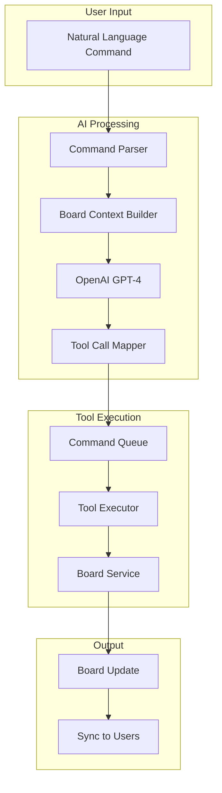

### 10.2 AI Tool Registry

```typescript
const aiTools: ToolDefinition[] = [
  {
    type: "function",
    function: {
      name: "createStickyNote",
      description: "Creates a new sticky note",
      parameters: {
        type: "object",
        properties: {
          text: { type: "string" },
          color: { type: "string", enum: ["yellow", "pink", "blue", "green"] },
          x: { type: "number" },
          y: { type: "number" }
        },
        required: ["text"]
      }
    }
  },
  // ... more tools
];
```

### 10.3 Multi-Step Command Flow

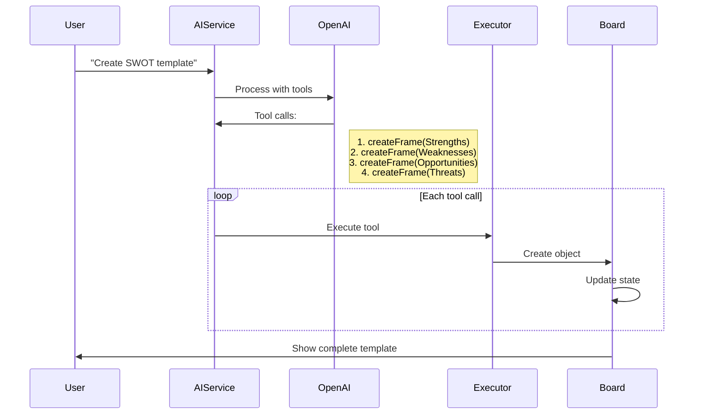

---

## Related Documents

- [Comprehensive PRD](./COMPREHENSIVE-PRD.md)
- [Git Workflow](./GIT-WORKFLOW.md)
- [Tech Stack Guides](./tech-guides/)

---

## Document History

| Version | Date | Changes |
|---------|------|---------|
| 1.0 | Feb 04, 2026 | Initial architecture document |
