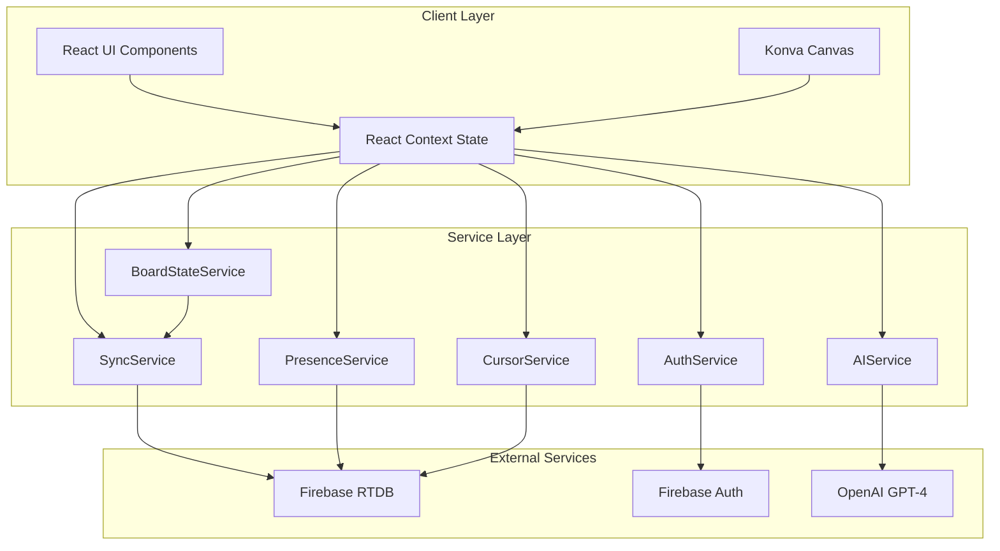
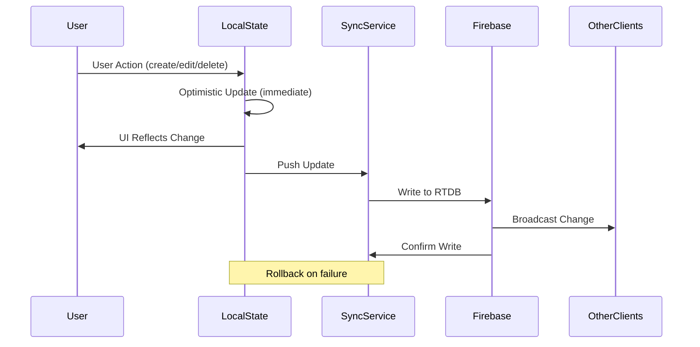
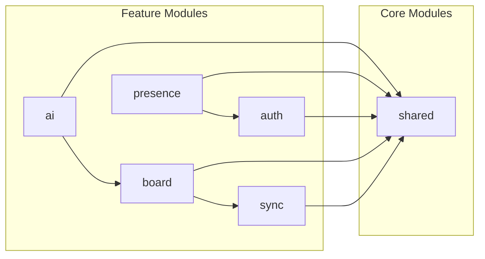
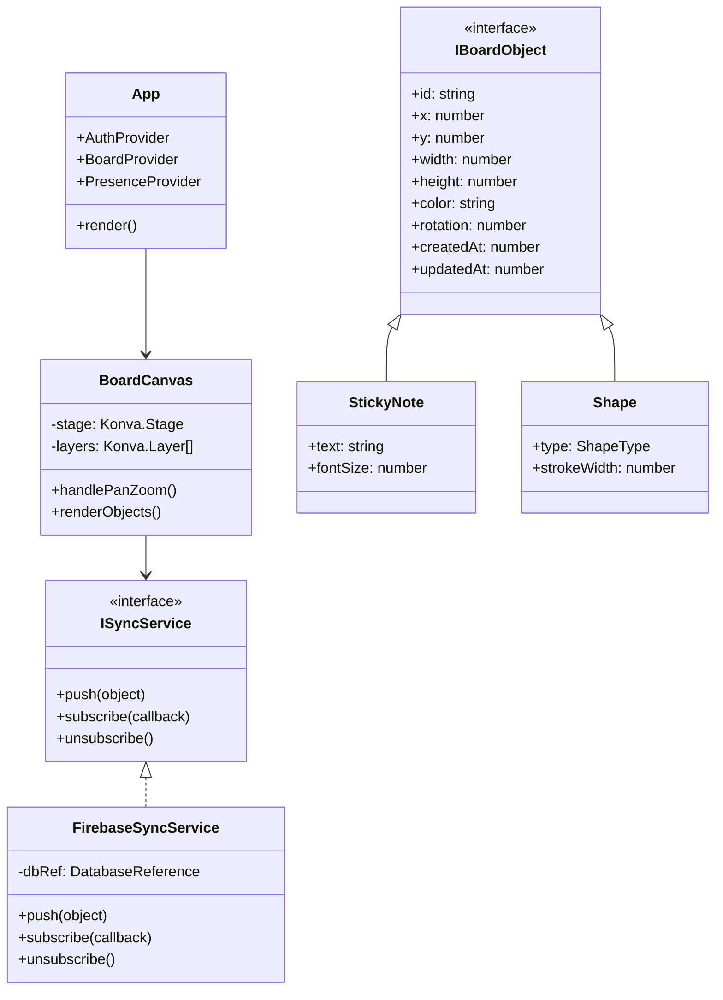
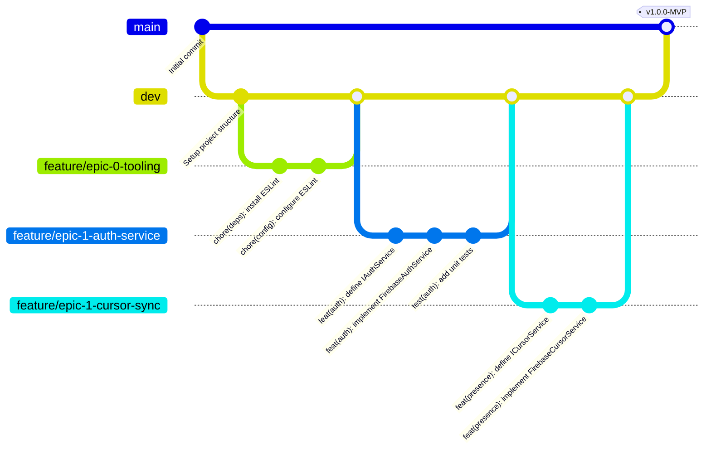
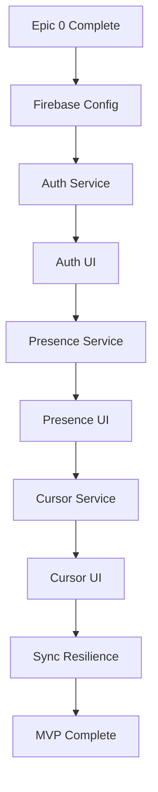
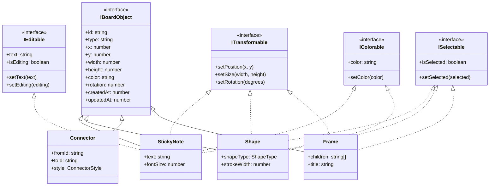
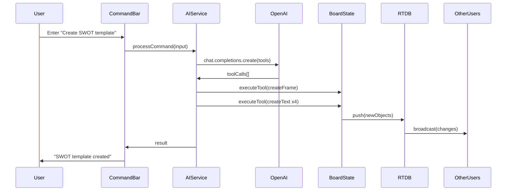
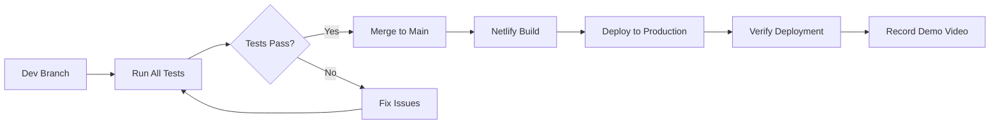
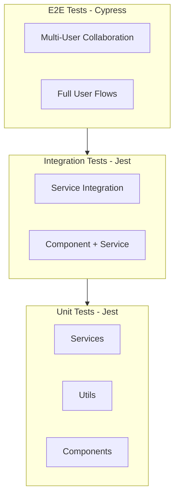

# Comprehensive Product Requirements Document (PRD) for CollabBoard

## Document Information

| Field | Value |
|-------|-------|
| Version | 2.0 (Comprehensive Edition) |
| Date | February 04, 2026 |
| Author | Development Team |
| Repository | [https://github.com/decagondev/colaboration-board-project](https://github.com/decagondev/colaboration-board-project) |
| Status | Active Development |

---

## Executive Summary

CollabBoard is a production-scale, real-time collaborative whiteboard application designed to enable seamless multi-user brainstorming, diagramming, and visual collaboration. Inspired by industry leaders like Miro, CollabBoard distinguishes itself through AI-first development methodologies and a natural language AI agent that allows users to manipulate board content through conversational commands.

This document serves as the definitive source of truth for the CollabBoard project, detailing all requirements, architecture decisions, implementation specifications, and delivery milestones. It is structured to support agile development with granular epics, user stories, and commit-level task breakdowns.

### Key Differentiators

1. **AI-Powered Manipulation**: Natural language commands for creating, arranging, and transforming board objects
2. **Real-Time Collaboration**: Sub-100ms synchronization with optimistic UI updates
3. **Infinite Canvas**: Smooth pan/zoom with 60 FPS performance at 500+ objects
4. **Production-Ready Infrastructure**: Conflict resolution, presence awareness, and offline resilience

---

## Glossary of Terms

| Term | Definition |
|------|------------|
| **SOLID** | Software design principles: Single Responsibility, Open/Closed, Liskov Substitution, Interface Segregation, Dependency Inversion |
| **DI** | Dependency Injection - a design pattern for achieving Inversion of Control |
| **MVP** | Minimum Viable Product - the smallest feature set for initial release |
| **RTDB** | Firebase Realtime Database |
| **OCP** | Open/Closed Principle - software entities should be open for extension but closed for modification |
| **SRP** | Single Responsibility Principle - a class should have only one reason to change |
| **ISP** | Interface Segregation Principle - clients should not depend on interfaces they don't use |
| **DIP** | Dependency Inversion Principle - depend on abstractions, not concretions |
| **LSP** | Liskov Substitution Principle - subtypes must be substitutable for their base types |
| **FPS** | Frames Per Second - measure of rendering performance |
| **e2e** | End-to-end testing |
| **tRPC** | TypeScript Remote Procedure Call - type-safe API framework |

---

## Table of Contents

1. [Project Vision and Goals](#1-project-vision-and-goals)
2. [Technology Stack](#2-technology-stack)
3. [Architecture Overview](#3-architecture-overview)
4. [SOLID Principles Implementation](#4-solid-principles-implementation)
5. [Module Specifications](#5-module-specifications)
6. [Git Workflow and Branching Strategy](#6-git-workflow-and-branching-strategy)
7. [Epic 0: Project Setup and Configuration](#7-epic-0-project-setup-and-configuration)
8. [Epic 1: Collaborative Infrastructure (MVP)](#8-epic-1-collaborative-infrastructure-mvp)
9. [Epic 2: Board Features](#9-epic-2-board-features)
10. [Epic 3: AI Board Agent](#10-epic-3-ai-board-agent)
11. [Epic 4: Deployment, Testing, and Polish](#11-epic-4-deployment-testing-and-polish)
12. [Testing Strategy and Scenarios](#12-testing-strategy-and-scenarios)
13. [Performance Requirements](#13-performance-requirements)
14. [Risk Assessment and Mitigations](#14-risk-assessment-and-mitigations)
15. [Cost Projections](#15-cost-projections)
16. [Appendices](#16-appendices)

---

## 1. Project Vision and Goals

### 1.1 Problem Statement

Modern teams require visual collaboration tools that support distributed work. Existing solutions often suffer from:

- High latency in multi-user scenarios
- Limited AI assistance for repetitive tasks
- Complex learning curves for advanced features
- Expensive pricing models for small teams

### 1.2 Solution Overview

CollabBoard addresses these challenges by providing:

- **Infinite Canvas Workspace**: A boundless digital surface for ideas
- **Real-Time Multiplayer**: Instantaneous synchronization across all connected clients
- **AI-Powered Commands**: Natural language interface for board manipulation
- **Presence Awareness**: Live cursor tracking and user status indicators
- **Resilient Architecture**: Offline support with conflict resolution

### 1.3 Success Metrics

| Metric | Target | Measurement Method |
|--------|--------|-------------------|
| Cursor Sync Latency | <50ms | Firebase listener timing + Konva render |
| Object Sync Latency | <100ms | RTDB push + broadcast measurement |
| Canvas FPS | 60 FPS | React DevTools profiler |
| AI Response Time | <2s | OpenAI API call + execution timing |
| Object Capacity | 500+ objects | Cypress stress test |
| Concurrent Users | 5+ users | Multi-browser test scenario |
| Test Coverage | 80% | Jest coverage report |

### 1.4 Timeline and Milestones

| Milestone | Target | Deliverables |
|-----------|--------|--------------|
| **MVP Gate** | 24 hours | Collaborative infrastructure (auth, presence, cursors, sync resilience) |
| **Full Features** | Friday | Complete board features + AI agent |
| **Polish & Deploy** | Sunday | Documentation, deployment, demo video |

### 1.5 Assumptions and Constraints

**Assumptions:**
- Solo developer based in London (EU Firebase region for optimal latency)
- Free tier services sufficient for MVP and initial scaling
- AI-first development workflow with 70% code generation from prompts
- Users have modern browsers with WebSocket support

**Constraints:**
- One-week development sprint
- Budget ceiling of $50 for development, scaling to $500 at 1,000 users
- Firebase free tier limits (1GB storage, 100k connections)
- OpenAI token costs (~$0.002/1k tokens)

---

## 2. Technology Stack

### 2.1 Core Technologies

| Layer | Technology | Version | Rationale |
|-------|------------|---------|-----------|
| Frontend Framework | React | 18.x | Mature SPA framework with excellent ecosystem |
| Canvas Library | Konva.js | 9.x | High-performance 2D canvas with React bindings |
| Backend/Database | Firebase RTDB | Latest | Native real-time sync with <50ms latency |
| Authentication | Firebase Auth | Latest | Integrated auth with presence support |
| AI Integration | OpenAI GPT-4 | gpt-4o | Reliable function calling for multi-step commands |
| API Architecture | tRPC | 11.x | End-to-end type safety with React Query |
| Build Tool | Vite | 5.x | Fast HMR and optimized production builds |
| Language | TypeScript | 5.x | Static typing for maintainability |

### 2.2 Development Tools

| Category | Tool | Purpose |
|----------|------|---------|
| Linting | ESLint | Code quality enforcement |
| Formatting | Prettier | Consistent code style |
| Testing (Unit) | Jest + ts-jest | Unit and integration tests |
| Testing (E2E) | Cypress | End-to-end browser tests |
| Pre-commit | Husky + lint-staged | Automated quality gates |
| Version Control | Git | Source control with branching strategy |

### 2.3 Deployment Infrastructure

| Component | Service | Configuration |
|-----------|---------|---------------|
| Hosting | Netlify | Static site deployment with serverless functions |
| Database | Firebase RTDB | EU region for London-based latency optimization |
| CDN | Netlify Edge | Global content delivery |
| CI/CD | Manual via Netlify Dashboard | Git-based deployments with previews |

### 2.4 Documentation Links

- [React Documentation](https://react.dev/)
- [Konva.js Documentation](https://konvajs.org/docs/index.html)
- [Firebase RTDB Documentation](https://firebase.google.com/docs/database)
- [Firebase Auth Documentation](https://firebase.google.com/docs/auth)
- [OpenAI API Documentation](https://platform.openai.com/docs/api-reference/introduction)
- [tRPC Documentation](https://trpc.io/docs)
- [Netlify Documentation](https://docs.netlify.com/)
- [ESLint Documentation](https://eslint.org/docs/latest)
- [Jest Documentation](https://jestjs.io/docs/getting-started)
- [Cypress Documentation](https://docs.cypress.io/)

---

## 3. Architecture Overview

### 3.1 High-Level System Architecture



### 3.2 Data Flow Architecture



### 3.3 Module Dependency Graph



### 3.4 Component Architecture



---

## 4. SOLID Principles Implementation

### 4.1 Single Responsibility Principle (SRP)

Each service and component has exactly one reason to change:

| Service/Component | Single Responsibility |
|-------------------|----------------------|
| `AuthService` | User authentication and session management only |
| `PresenceService` | Online/offline status tracking only |
| `CursorService` | Cursor position synchronization only |
| `SyncService` | RTDB data synchronization only |
| `BoardStateService` | Local board state management only |
| `SelectionService` | Object selection state only |
| `AICommandProcessor` | AI command parsing and execution only |
| `BoardRenderer` | Konva canvas rendering only |

**Implementation Example:**

```typescript
/**
 * AuthService handles ONLY authentication concerns.
 * It does not handle presence, cursors, or any other functionality.
 */
interface IAuthService {
  signIn(email: string, password: string): Promise<User>;
  signUp(email: string, password: string): Promise<User>;
  signOut(): Promise<void>;
  getCurrentUser(): User | null;
  onAuthStateChanged(callback: AuthStateCallback): Unsubscribe;
}
```

### 4.2 Open/Closed Principle (OCP)

The system is open for extension but closed for modification through:

**Interface-Based Extension:**

```typescript
/**
 * New board object types can be added by implementing IBoardObject
 * without modifying existing code.
 */
interface IBoardObject {
  id: string;
  type: string;
  x: number;
  y: number;
  width: number;
  height: number;
  color: string;
  rotation: number;
  createdAt: number;
  updatedAt: number;
}

/** Sticky notes extend the base interface */
interface IStickyNote extends IBoardObject {
  type: 'sticky-note';
  text: string;
  fontSize: number;
}

/** Shapes extend the base interface */
interface IShape extends IBoardObject {
  type: 'shape';
  shapeType: 'rectangle' | 'circle' | 'line';
  strokeWidth: number;
}

/** Future: Images can be added without modifying existing code */
interface IImage extends IBoardObject {
  type: 'image';
  src: string;
  aspectRatio: number;
}
```

**Factory Pattern for Object Creation:**

```typescript
/**
 * ObjectFactory allows registration of new object types
 * without modifying the factory itself.
 */
class ObjectFactory {
  private registry = new Map<string, ObjectCreator>();

  register(type: string, creator: ObjectCreator): void {
    this.registry.set(type, creator);
  }

  create(type: string, props: Partial<IBoardObject>): IBoardObject {
    const creator = this.registry.get(type);
    if (!creator) {
      throw new Error(`Unknown object type: ${type}`);
    }
    return creator(props);
  }
}
```

### 4.3 Liskov Substitution Principle (LSP)

All implementations are substitutable for their base types:

```typescript
/**
 * Any ISyncService implementation can be used interchangeably.
 * This enables testing with mocks and future backend swaps.
 */
interface ISyncService {
  push(object: IBoardObject): Promise<void>;
  subscribe(callback: SyncCallback): Unsubscribe;
  delete(objectId: string): Promise<void>;
}

class FirebaseSyncService implements ISyncService {
  async push(object: IBoardObject): Promise<void> { /* Firebase implementation */ }
  subscribe(callback: SyncCallback): Unsubscribe { /* Firebase implementation */ }
  async delete(objectId: string): Promise<void> { /* Firebase implementation */ }
}

class MockSyncService implements ISyncService {
  async push(object: IBoardObject): Promise<void> { /* Mock for testing */ }
  subscribe(callback: SyncCallback): Unsubscribe { /* Mock for testing */ }
  async delete(objectId: string): Promise<void> { /* Mock for testing */ }
}

/** Both can be used wherever ISyncService is expected */
function createBoardComponent(syncService: ISyncService): BoardComponent {
  // Works with FirebaseSyncService or MockSyncService
}
```

### 4.4 Interface Segregation Principle (ISP)

Interfaces are small and focused:

```typescript
/**
 * Instead of one large IBoardObject interface with all behaviors,
 * we use small, focused interfaces that objects can implement as needed.
 */

/** Objects that can be moved, resized, rotated */
interface ITransformable {
  setPosition(x: number, y: number): void;
  setSize(width: number, height: number): void;
  setRotation(degrees: number): void;
}

/** Objects that have editable text content */
interface IEditable {
  text: string;
  setText(text: string): void;
  isEditing: boolean;
  setEditing(editing: boolean): void;
}

/** Objects that can change color */
interface IColorable {
  color: string;
  setColor(color: string): void;
}

/** Objects that can be selected */
interface ISelectable {
  isSelected: boolean;
  setSelected(selected: boolean): void;
}

/** Objects that can serve as connector endpoints */
interface IConnectable {
  getConnectionPoint(position: ConnectionPosition): Point;
}

/**
 * StickyNote implements only the interfaces it needs.
 * It doesn't implement IConnectable because sticky notes
 * don't serve as connector endpoints.
 */
class StickyNote implements IBoardObject, ITransformable, IEditable, IColorable, ISelectable {
  // Implementation
}
```

### 4.5 Dependency Inversion Principle (DIP)

High-level modules depend on abstractions:

```typescript
/**
 * Components receive dependencies through injection,
 * depending on interfaces rather than concrete implementations.
 */

interface BoardCanvasProps {
  syncService: ISyncService;
  presenceService: IPresenceService;
  cursorService: ICursorService;
  boardState: IBoardState;
}

function BoardCanvas({
  syncService,
  presenceService,
  cursorService,
  boardState
}: BoardCanvasProps): JSX.Element {
  // Component uses interfaces, not concrete implementations
  // This enables testing with mocks and future implementation swaps
}

/**
 * Service container provides dependency injection.
 */
interface ServiceContainer {
  authService: IAuthService;
  syncService: ISyncService;
  presenceService: IPresenceService;
  cursorService: ICursorService;
  aiService: IAIService;
}

function createServiceContainer(): ServiceContainer {
  // In production: real implementations
  // In tests: mock implementations
  return {
    authService: new FirebaseAuthService(),
    syncService: new FirebaseSyncService(),
    presenceService: new FirebasePresenceService(),
    cursorService: new FirebaseCursorService(),
    aiService: new OpenAIService(),
  };
}
```

---

## 5. Module Specifications

### 5.1 Directory Structure

```
src/
├── auth/                           # Authentication module
│   ├── interfaces/
│   │   └── IAuthService.ts         # Auth service interface
│   ├── services/
│   │   └── FirebaseAuthService.ts  # Firebase auth implementation
│   ├── hooks/
│   │   └── useAuth.ts              # Auth React hook
│   ├── components/
│   │   ├── LoginComponent.tsx      # Login form
│   │   ├── SignupComponent.tsx     # Signup form
│   │   └── AuthGuard.tsx           # Protected route wrapper
│   ├── context/
│   │   └── AuthContext.tsx         # Auth state context
│   └── index.ts                    # Public exports
│
├── board/                          # Board canvas module
│   ├── interfaces/
│   │   ├── IBoardObject.ts         # Base object interface
│   │   ├── IBoardState.ts          # Board state interface
│   │   ├── ITransformable.ts       # Transform capability
│   │   ├── IEditable.ts            # Edit capability
│   │   ├── ISelectable.ts          # Selection capability
│   │   └── IColorable.ts           # Color capability
│   ├── objects/
│   │   ├── StickyNote.ts           # Sticky note implementation
│   │   ├── Shape.ts                # Shape base class
│   │   ├── Rectangle.ts            # Rectangle shape
│   │   ├── Circle.ts               # Circle shape
│   │   ├── Line.ts                 # Line shape
│   │   ├── Connector.ts            # Connector implementation
│   │   ├── Frame.ts                # Frame/group implementation
│   │   ├── StandaloneText.ts       # Text object
│   │   └── ObjectFactory.ts        # Object factory
│   ├── services/
│   │   ├── BoardStateService.ts    # State management
│   │   └── SelectionService.ts     # Selection management
│   ├── hooks/
│   │   ├── useBoardState.ts        # Board state hook
│   │   └── useSelection.ts         # Selection hook
│   ├── components/
│   │   ├── BoardCanvasComponent.tsx    # Main canvas
│   │   ├── StickyNoteComponent.tsx     # Sticky note renderer
│   │   ├── ShapeComponent.tsx          # Shape renderer
│   │   ├── ConnectorComponent.tsx      # Connector renderer
│   │   ├── FrameComponent.tsx          # Frame renderer
│   │   ├── TextComponent.tsx           # Text renderer
│   │   ├── ToolbarComponent.tsx        # Tool selection
│   │   ├── ColorPickerComponent.tsx    # Color selection
│   │   └── ZoomControlsComponent.tsx   # Zoom UI
│   ├── context/
│   │   └── BoardContext.tsx        # Board state context
│   └── index.ts
│
├── sync/                           # Real-time sync module
│   ├── interfaces/
│   │   └── ISyncService.ts         # Sync service interface
│   ├── services/
│   │   └── FirebaseSyncService.ts  # Firebase sync implementation
│   ├── hooks/
│   │   └── useBoardSync.ts         # Sync React hook
│   ├── utils/
│   │   ├── optimisticUpdate.ts     # Optimistic update logic
│   │   └── conflictResolution.ts   # Last-write-wins logic
│   └── index.ts
│
├── presence/                       # User presence module
│   ├── interfaces/
│   │   ├── IPresenceService.ts     # Presence service interface
│   │   └── ICursorService.ts       # Cursor service interface
│   ├── services/
│   │   ├── FirebasePresenceService.ts  # Presence implementation
│   │   └── FirebaseCursorService.ts    # Cursor implementation
│   ├── hooks/
│   │   ├── usePresence.ts          # Presence hook
│   │   └── useCursors.ts           # Cursors hook
│   ├── components/
│   │   ├── PresenceListComponent.tsx   # Online users list
│   │   ├── CursorOverlayComponent.tsx  # Remote cursors
│   │   └── UserAvatarComponent.tsx     # User avatar
│   ├── context/
│   │   └── PresenceContext.tsx     # Presence state context
│   └── index.ts
│
├── ai/                             # AI agent module
│   ├── interfaces/
│   │   └── IAIService.ts           # AI service interface
│   ├── services/
│   │   └── OpenAIService.ts        # OpenAI implementation
│   ├── tools/
│   │   ├── schemas/
│   │   │   ├── createStickyNote.ts # Create note schema
│   │   │   ├── createShape.ts      # Create shape schema
│   │   │   ├── moveObjects.ts      # Move objects schema
│   │   │   ├── resizeObjects.ts    # Resize objects schema
│   │   │   ├── changeColor.ts      # Change color schema
│   │   │   ├── deleteObjects.ts    # Delete objects schema
│   │   │   ├── arrangeInGrid.ts    # Grid arrangement schema
│   │   │   ├── createSWOT.ts       # SWOT template schema
│   │   │   └── createUserJourney.ts # User journey schema
│   │   ├── executors/
│   │   │   └── ToolExecutor.ts     # Tool execution logic
│   │   └── AITools.ts              # Tool registry
│   ├── hooks/
│   │   └── useAICommands.ts        # AI commands hook
│   ├── components/
│   │   ├── AICommandBarComponent.tsx   # Command input
│   │   └── AIStatusIndicator.tsx       # Processing status
│   ├── context/
│   │   └── AIContext.tsx           # AI state context
│   └── index.ts
│
├── shared/                         # Shared utilities
│   ├── config/
│   │   ├── firebase.ts             # Firebase configuration
│   │   └── environment.ts          # Environment variables
│   ├── types/
│   │   ├── common.ts               # Common type definitions
│   │   └── events.ts               # Event type definitions
│   ├── utils/
│   │   ├── debounce.ts             # Debounce utility
│   │   ├── throttle.ts             # Throttle utility
│   │   ├── uuid.ts                 # UUID generation
│   │   └── coordinates.ts          # Coordinate transforms
│   ├── hooks/
│   │   └── useEventListener.ts     # Event listener hook
│   └── index.ts
│
├── App.tsx                         # Root application component
├── main.tsx                        # Application entry point
└── vite-env.d.ts                   # Vite type declarations
```

### 5.2 Module Interfaces

#### Auth Module Interface

```typescript
/** src/auth/interfaces/IAuthService.ts */

export interface User {
  uid: string;
  email: string | null;
  displayName: string | null;
  photoURL: string | null;
}

export type AuthStateCallback = (user: User | null) => void;
export type Unsubscribe = () => void;

export interface IAuthService {
  /**
   * Signs in a user with email and password.
   * @param email - User's email address
   * @param password - User's password
   * @returns Promise resolving to the authenticated user
   * @throws AuthError if credentials are invalid
   */
  signIn(email: string, password: string): Promise<User>;

  /**
   * Creates a new user account.
   * @param email - User's email address
   * @param password - User's password
   * @returns Promise resolving to the new user
   * @throws AuthError if email is already in use
   */
  signUp(email: string, password: string): Promise<User>;

  /**
   * Signs out the current user.
   * @returns Promise resolving when sign out is complete
   */
  signOut(): Promise<void>;

  /**
   * Gets the currently authenticated user.
   * @returns The current user or null if not authenticated
   */
  getCurrentUser(): User | null;

  /**
   * Subscribes to authentication state changes.
   * @param callback - Function called when auth state changes
   * @returns Unsubscribe function to stop listening
   */
  onAuthStateChanged(callback: AuthStateCallback): Unsubscribe;
}
```

#### Sync Module Interface

```typescript
/** src/sync/interfaces/ISyncService.ts */

import { IBoardObject } from '../../board/interfaces/IBoardObject';

export type SyncCallback = (objects: IBoardObject[]) => void;
export type Unsubscribe = () => void;

export interface ISyncService {
  /**
   * Pushes an object update to the remote database.
   * Uses optimistic updates for immediate local feedback.
   * @param object - The board object to sync
   * @returns Promise resolving when sync is complete
   */
  push(object: IBoardObject): Promise<void>;

  /**
   * Pushes multiple object updates in a batch.
   * @param objects - Array of board objects to sync
   * @returns Promise resolving when all syncs are complete
   */
  pushBatch(objects: IBoardObject[]): Promise<void>;

  /**
   * Subscribes to remote object changes.
   * @param boardId - The board to subscribe to
   * @param callback - Function called when objects change
   * @returns Unsubscribe function to stop listening
   */
  subscribe(boardId: string, callback: SyncCallback): Unsubscribe;

  /**
   * Deletes an object from the remote database.
   * @param objectId - ID of the object to delete
   * @returns Promise resolving when deletion is complete
   */
  delete(objectId: string): Promise<void>;

  /**
   * Deletes multiple objects in a batch.
   * @param objectIds - IDs of objects to delete
   * @returns Promise resolving when all deletions are complete
   */
  deleteBatch(objectIds: string[]): Promise<void>;
}
```

#### Presence Module Interfaces

```typescript
/** src/presence/interfaces/IPresenceService.ts */

export interface OnlineUser {
  uid: string;
  displayName: string;
  photoURL: string | null;
  lastSeen: number;
}

export type PresenceCallback = (users: OnlineUser[]) => void;
export type Unsubscribe = () => void;

export interface IPresenceService {
  /**
   * Sets the current user as online.
   * @param userId - The user's ID
   * @param displayName - The user's display name
   * @returns Promise resolving when presence is set
   */
  setOnline(userId: string, displayName: string): Promise<void>;

  /**
   * Sets the current user as offline.
   * @param userId - The user's ID
   * @returns Promise resolving when presence is cleared
   */
  setOffline(userId: string): Promise<void>;

  /**
   * Subscribes to presence changes for a board.
   * @param boardId - The board to watch
   * @param callback - Function called when presence changes
   * @returns Unsubscribe function to stop listening
   */
  subscribeToPresence(boardId: string, callback: PresenceCallback): Unsubscribe;

  /**
   * Gets all currently online users for a board.
   * @param boardId - The board to query
   * @returns Promise resolving to array of online users
   */
  getOnlineUsers(boardId: string): Promise<OnlineUser[]>;
}
```

```typescript
/** src/presence/interfaces/ICursorService.ts */

export interface CursorPosition {
  userId: string;
  displayName: string;
  x: number;
  y: number;
  color: string;
  lastUpdated: number;
}

export type CursorCallback = (cursors: CursorPosition[]) => void;
export type Unsubscribe = () => void;

export interface ICursorService {
  /**
   * Updates the current user's cursor position.
   * Debounced to 50ms for performance.
   * @param userId - The user's ID
   * @param x - X coordinate in world space
   * @param y - Y coordinate in world space
   * @returns Promise resolving when position is updated
   */
  updatePosition(userId: string, x: number, y: number): Promise<void>;

  /**
   * Subscribes to all cursor positions for a board.
   * @param boardId - The board to watch
   * @param callback - Function called when cursors change
   * @returns Unsubscribe function to stop listening
   */
  subscribeToAllCursors(boardId: string, callback: CursorCallback): Unsubscribe;

  /**
   * Removes a user's cursor when they disconnect.
   * @param userId - The user's ID
   * @returns Promise resolving when cursor is removed
   */
  removeCursor(userId: string): Promise<void>;
}
```

#### AI Module Interface

```typescript
/** src/ai/interfaces/IAIService.ts */

export interface AICommand {
  id: string;
  userId: string;
  input: string;
  status: 'pending' | 'processing' | 'completed' | 'failed';
  result?: AICommandResult;
  error?: string;
  createdAt: number;
}

export interface AICommandResult {
  toolCalls: ToolCall[];
  message?: string;
}

export interface ToolCall {
  name: string;
  arguments: Record<string, unknown>;
}

export interface IAIService {
  /**
   * Processes a natural language command.
   * @param command - The user's natural language input
   * @param boardState - Current state of the board for context
   * @returns Promise resolving to tool calls to execute
   */
  processCommand(
    command: string,
    boardState: IBoardObject[]
  ): Promise<ToolCall[]>;

  /**
   * Executes a tool call on the board.
   * @param toolCall - The tool call to execute
   * @param boardService - Service to modify board state
   * @returns Promise resolving when execution is complete
   */
  executeTool(
    toolCall: ToolCall,
    boardService: IBoardStateService
  ): Promise<void>;

  /**
   * Gets the available AI tools and their schemas.
   * @returns Array of tool definitions
   */
  getAvailableTools(): ToolDefinition[];
}
```

---

## 6. Git Workflow and Branching Strategy

### 6.1 Branch Hierarchy



### 6.2 Branch Types and Naming Conventions

| Branch Type | Pattern | Example | Purpose |
|-------------|---------|---------|---------|
| Main | `main` | `main` | Production-ready releases only |
| Development | `dev` | `dev` | Integration branch for features |
| Feature | `feature/epic-X-name` | `feature/epic-1-auth-service` | New functionality |
| Fix | `fix/issue-description` | `fix/cursor-sync-latency` | Bug fixes |
| Chore | `chore/task-description` | `chore/update-dependencies` | Maintenance tasks |
| Docs | `docs/topic` | `docs/api-reference` | Documentation changes |

### 6.3 Commit Message Convention

```
type(scope): description

[optional body]

[optional footer]
```

**Types:**
- `feat` - New feature
- `fix` - Bug fix
- `docs` - Documentation only
- `style` - Formatting, no code change
- `refactor` - Code restructuring
- `test` - Adding or updating tests
- `chore` - Maintenance tasks
- `perf` - Performance improvements

**Scopes:**
- `auth` - Authentication module
- `board` - Board canvas module
- `sync` - Sync module
- `presence` - Presence module
- `ai` - AI module
- `config` - Configuration
- `deps` - Dependencies

**Examples:**

```
feat(auth): implement Firebase authentication service

Add FirebaseAuthService with signIn, signUp, and signOut methods.
Includes error handling for invalid credentials.

Closes #12
```

```
fix(sync): resolve race condition in optimistic updates

Apply local update before async push to prevent UI flicker.
Add rollback mechanism for failed syncs.
```

### 6.4 Workflow Process

1. **Create Feature Branch**
   ```bash
   git checkout dev
   git pull origin dev
   git checkout -b feature/epic-1-auth-service
   ```

2. **Make Granular Commits**
   ```bash
   git add src/auth/interfaces/IAuthService.ts
   git commit -m "feat(auth): define IAuthService interface"
   
   git add src/auth/services/FirebaseAuthService.ts
   git commit -m "feat(auth): implement FirebaseAuthService"
   ```

3. **Write and Run Tests**
   ```bash
   npm test
   npm run test:e2e
   ```

4. **Merge to Dev**
   ```bash
   git checkout dev
   git pull origin dev
   git merge feature/epic-1-auth-service
   git push origin dev
   ```

5. **Release to Main**
   ```bash
   git checkout main
   git merge dev
   git tag -a v1.0.0 -m "MVP Release"
   git push origin main --tags
   ```

### 6.5 Code Review Guidelines

For solo development, self-review checklist before merge:

- [ ] All tests pass
- [ ] No linting errors
- [ ] TypeScript compiles without errors
- [ ] SOLID principles followed
- [ ] Documentation updated
- [ ] No hardcoded secrets
- [ ] Performance impact considered

---

## 7. Epic 0: Project Setup and Configuration

### 7.1 Overview

| Attribute | Value |
|-----------|-------|
| Priority | Critical |
| Timeline | Hours 1-2 |
| Dependencies | None |
| Risk Level | Low |

### 7.2 User Stories

#### User Story 0.1: Repository and Branch Setup

**As a** developer  
**I want** the repository properly configured with a dev branch  
**So that** I can follow the established git workflow

**Acceptance Criteria:**
- Dev branch exists and is set as default for development
- Directory structure matches module specification
- .gitignore covers all build artifacts and secrets
- .cursor/rules.md contains SOLID and coding guidelines

**Branch:** `feature/epic-0-repo-setup`

**Commits:**

| # | Message | Subtasks |
|---|---------|----------|
| 1 | `chore(config): create dev branch from main` | Create branch, verify checkout |
| 2 | `chore(config): setup directory structure` | Create src/, tests/, docs/ directories with module folders |
| 3 | `docs(rules): add .cursor/rules.md with SOLID guidelines` | Write comprehensive coding rules |
| 4 | `chore(config): update .gitignore` | Add node_modules, .env, dist, coverage |

---

#### User Story 0.2: Development Tooling

**As a** developer  
**I want** ESLint and Prettier configured  
**So that** code quality is automatically enforced

**Acceptance Criteria:**
- ESLint runs without errors on clean codebase
- Prettier formats code on save
- Husky pre-commit hooks prevent bad commits
- lint-staged runs only on changed files

**Branch:** `feature/epic-0-tooling`

**Commits:**

| # | Message | Subtasks |
|---|---------|----------|
| 1 | `chore(deps): install ESLint and Prettier` | npm i -D eslint prettier eslint-config-airbnb eslint-plugin-react @typescript-eslint/eslint-plugin @typescript-eslint/parser eslint-plugin-react-hooks eslint-config-prettier eslint-plugin-prettier |
| 2 | `chore(config): configure ESLint with Airbnb + TypeScript` | Create .eslintrc.cjs with extends, rules, plugins |
| 3 | `chore(config): configure Prettier with project settings` | Create .prettierrc with singleQuote, semi, tabWidth |
| 4 | `chore(deps): install and configure Husky pre-commit hooks` | npx husky-init, configure pre-commit |
| 5 | `chore(config): add lint-staged for incremental linting` | Configure lint-staged in package.json |

---

#### User Story 0.3: TypeScript and Build Configuration

**As a** developer  
**I want** TypeScript and Vite properly configured  
**So that** I have type safety and fast builds

**Acceptance Criteria:**
- TypeScript compiles with strict mode
- Vite dev server starts without errors
- Path aliases resolve correctly
- Production build succeeds

**Branch:** `feature/epic-0-typescript`

**Commits:**

| # | Message | Subtasks |
|---|---------|----------|
| 1 | `chore(deps): install TypeScript and type definitions` | npm i -D typescript @types/react @types/react-dom @types/node |
| 2 | `chore(config): configure tsconfig.json with strict mode` | Set strict: true, module: ESNext, paths |
| 3 | `chore(config): setup Vite for React build` | npm i vite @vitejs/plugin-react, create vite.config.ts |
| 4 | `chore(config): add path aliases for modules` | Configure @ paths in tsconfig and vite |

---

#### User Story 0.4: Testing Infrastructure

**As a** developer  
**I want** Jest and Cypress configured  
**So that** I can write unit and e2e tests

**Acceptance Criteria:**
- Jest runs TypeScript tests
- Cypress opens test runner
- Sample tests pass
- Coverage reporting works

**Branch:** `feature/epic-0-testing`

**Commits:**

| # | Message | Subtasks |
|---|---------|----------|
| 1 | `chore(deps): install Jest and ts-jest` | npm i -D jest ts-jest @types/jest @testing-library/react @testing-library/jest-dom |
| 2 | `chore(config): configure jest.config.ts` | Set preset, testEnvironment, moduleNameMapper |
| 3 | `chore(deps): install Cypress` | npm i -D cypress |
| 4 | `chore(config): configure cypress.config.ts` | Set baseUrl, viewportWidth, viewportHeight |
| 5 | `test(setup): add sample passing test` | Create src/__tests__/sample.test.ts |

---

## 8. Epic 1: Collaborative Infrastructure (MVP)

### 8.1 Overview

| Attribute | Value |
|-----------|-------|
| Priority | Critical (MVP Gate) |
| Timeline | Hours 3-24 |
| Dependencies | Epic 0 |
| Risk Level | Medium |

**Key Performance Targets:**
- Cursor sync: <50ms latency
- 5+ concurrent users without degradation
- Presence updates: Real-time

### 8.2 Epic Flow Diagram



### 8.3 User Stories

#### User Story 1.1: Firebase Configuration

**As a** developer  
**I want** Firebase properly configured  
**So that** I can use RTDB and Auth services

**Acceptance Criteria:**
- Firebase SDK installed and initialized
- Environment variables documented
- Firebase console setup instructions provided

**Branch:** `feature/epic-1-firebase-config`

**Commits:**

| # | Message | Subtasks |
|---|---------|----------|
| 1 | `chore(deps): install firebase SDK` | npm i firebase |
| 2 | `feat(config): create Firebase app initialization` | Create src/shared/config/firebase.ts |
| 3 | `chore(config): setup .env.example with Firebase keys` | Document all required environment variables |
| 4 | `docs(setup): add Firebase console setup instructions` | Update README with Firebase setup guide |

---

#### User Story 1.2: Authentication Service

**As a** user  
**I want** to authenticate with email/password  
**So that** I can access the board securely

**Acceptance Criteria:**
- IAuthService interface defined
- FirebaseAuthService implements all methods
- Error handling for invalid credentials
- Unit tests pass

**Branch:** `feature/epic-1-auth-service`

**Interface Definition:**
```typescript
interface IAuthService {
  signIn(email: string, password: string): Promise<User>;
  signUp(email: string, password: string): Promise<User>;
  signOut(): Promise<void>;
  getCurrentUser(): User | null;
  onAuthStateChanged(callback: AuthStateCallback): Unsubscribe;
}
```

**Commits:**

| # | Message | Subtasks |
|---|---------|----------|
| 1 | `feat(auth): define IAuthService interface` | Create src/auth/interfaces/IAuthService.ts with full JSDoc |
| 2 | `feat(auth): implement FirebaseAuthService` | Implement all interface methods with Firebase SDK |
| 3 | `feat(auth): add error handling and validation` | Add try/catch, custom error types |
| 4 | `test(auth): add unit tests for AuthService` | Test signIn, signUp, signOut with mocks |

---

#### User Story 1.3: Authentication UI

**As a** user  
**I want** a login form  
**So that** I can sign in to access the board

**Acceptance Criteria:**
- Login form with email/password fields
- Form validation with error display
- Redirect to board on successful auth
- Protected routes require authentication

**Branch:** `feature/epic-1-auth-ui`

**Commits:**

| # | Message | Subtasks |
|---|---------|----------|
| 1 | `feat(auth): create LoginComponent with form` | Create form with useState for inputs |
| 2 | `feat(auth): add form validation with error display` | Add validation logic, error messages |
| 3 | `feat(auth): implement auth state context provider` | Create AuthContext with useAuth hook |
| 4 | `feat(auth): add protected route wrapper` | Create AuthGuard component |
| 5 | `test(auth): add Cypress e2e for login flow` | Test login, logout, redirect |

---

#### User Story 1.4: Presence Service

**As a** user  
**I want** to see who is online  
**So that** I know who I'm collaborating with

**Acceptance Criteria:**
- IPresenceService interface defined
- Online status synced to RTDB
- Automatic offline on disconnect
- Unit tests pass

**Branch:** `feature/epic-1-presence-service`

**Interface Definition:**
```typescript
interface IPresenceService {
  setOnline(userId: string, displayName: string): Promise<void>;
  setOffline(userId: string): Promise<void>;
  subscribeToPresence(boardId: string, callback: PresenceCallback): Unsubscribe;
  getOnlineUsers(boardId: string): Promise<OnlineUser[]>;
}
```

**Commits:**

| # | Message | Subtasks |
|---|---------|----------|
| 1 | `feat(presence): define IPresenceService interface` | Create interface with JSDoc |
| 2 | `feat(presence): implement FirebasePresenceService` | Use RTDB ref('presence/{boardId}/{userId}') |
| 3 | `feat(presence): add onDisconnect handling` | Use onDisconnect().remove() for cleanup |
| 4 | `feat(presence): integrate with auth lifecycle` | Set online on login, offline on logout |
| 5 | `test(presence): add unit tests` | Test setOnline, setOffline, subscribe |

---

#### User Story 1.5: Presence UI

**As a** user  
**I want** to see a list of online users  
**So that** I'm aware of collaborators

**Acceptance Criteria:**
- User list displays online users
- Real-time updates on join/leave
- User avatars displayed
- Toast notifications on join/leave

**Branch:** `feature/epic-1-presence-ui`

**Commits:**

| # | Message | Subtasks |
|---|---------|----------|
| 1 | `feat(presence): create PresenceListComponent` | Display list with user names |
| 2 | `feat(presence): add real-time subscription hook` | Create usePresence hook |
| 3 | `feat(presence): add user avatar display` | Show initials or photo |
| 4 | `feat(presence): add join/leave toast notifications` | Integrate react-toastify |
| 5 | `test(presence): add Cypress multi-user test` | Test with two browser sessions |

---

#### User Story 1.6: Cursor Sync Service

**As a** user  
**I want** to see other users' cursors  
**So that** I know where they're working

**Acceptance Criteria:**
- ICursorService interface defined
- Cursor positions synced <50ms
- Debounced to prevent flooding
- Unit tests pass

**Branch:** `feature/epic-1-cursor-service`

**Interface Definition:**
```typescript
interface ICursorService {
  updatePosition(userId: string, x: number, y: number): Promise<void>;
  subscribeToAllCursors(boardId: string, callback: CursorCallback): Unsubscribe;
  removeCursor(userId: string): Promise<void>;
}
```

**Commits:**

| # | Message | Subtasks |
|---|---------|----------|
| 1 | `feat(presence): define ICursorService interface` | Create interface with JSDoc |
| 2 | `feat(presence): implement FirebaseCursorService` | Use RTDB ref('cursors/{boardId}/{userId}') |
| 3 | `feat(presence): add debounce (50ms) for updates` | Use lodash debounce or custom |
| 4 | `feat(presence): add viewport coordinate transform` | Convert screen to world coords |
| 5 | `test(presence): add latency tests (<50ms target)` | Measure round-trip time |

---

#### User Story 1.7: Cursor UI

**As a** user  
**I want** to see cursor pointers with names  
**So that** I can identify who is doing what

**Acceptance Criteria:**
- Cursors rendered as colored pointers
- User name displayed near cursor
- Only visible cursors rendered (viewport culling)
- Smooth interpolation for movement

**Branch:** `feature/epic-1-cursor-ui`

**Commits:**

| # | Message | Subtasks |
|---|---------|----------|
| 1 | `feat(presence): create CursorOverlayComponent` | Create Konva layer for cursors |
| 2 | `feat(presence): render Konva arrows with labels` | Add Arrow + Text shapes |
| 3 | `feat(presence): add mouse event capture` | Listen to mousemove on canvas |
| 4 | `feat(presence): optimize for viewport culling` | Only render visible cursors |
| 5 | `test(presence): add multi-browser cursor test` | Verify cursors appear in both sessions |

---

#### User Story 1.8: Sync Resilience

**As a** user  
**I want** my changes to persist  
**So that** I don't lose work on disconnect

**Acceptance Criteria:**
- Optimistic updates show immediately
- Conflicts resolved with last-write-wins
- Reconnection resyncs state
- Network throttling handled gracefully

**Branch:** `feature/epic-1-sync-resilience`

**Commits:**

| # | Message | Subtasks |
|---|---------|----------|
| 1 | `feat(sync): implement optimistic updates pattern` | Apply local, then push async |
| 2 | `feat(sync): add timestamp-based conflict resolution` | Compare updatedAt timestamps |
| 3 | `feat(sync): add reconnection handler` | Use .info/connected listener |
| 4 | `feat(sync): add offline state persistence` | Enable Firebase persistence |
| 5 | `test(sync): add network throttling tests` | Use Cypress to throttle network |
| 6 | `test(sync): add simultaneous edit conflict tests` | Two users edit same object |

---

## 9. Epic 2: Board Features

### 9.1 Overview

| Attribute | Value |
|-----------|-------|
| Priority | High |
| Timeline | Days 2-4 |
| Dependencies | Epic 1 |
| Risk Level | Medium |

**Key Performance Targets:**
- Canvas: 60 FPS pan/zoom
- Object capacity: 500+ objects
- Object sync: <100ms latency

### 9.2 Object Type Hierarchy



### 9.3 User Stories

#### User Story 2.1: Canvas Setup

**As a** user  
**I want** an infinite canvas  
**So that** I have unlimited space for ideas

**Acceptance Criteria:**
- Konva Stage renders correctly
- Canvas fills viewport
- Viewport culling implemented
- No performance degradation

**Branch:** `feature/epic-2-canvas-setup`

**Commits:**

| # | Message | Subtasks |
|---|---------|----------|
| 1 | `chore(deps): install konva and react-konva` | npm i konva react-konva @types/konva |
| 2 | `feat(board): create BoardCanvasComponent with Stage` | Set up Stage and Layer |
| 3 | `feat(board): implement infinite canvas with Layer` | Configure for infinite bounds |
| 4 | `feat(board): add viewport culling logic` | Only render visible objects |
| 5 | `test(board): add canvas render test` | Verify Stage mounts correctly |

---

#### User Story 2.2: Pan and Zoom

**As a** user  
**I want** to pan and zoom the canvas  
**So that** I can navigate large boards

**Acceptance Criteria:**
- Mouse wheel zooms in/out
- Drag pans the canvas
- Zoom has min/max limits
- 60 FPS maintained during interaction

**Branch:** `feature/epic-2-pan-zoom`

**Commits:**

| # | Message | Subtasks |
|---|---------|----------|
| 1 | `feat(board): add wheel zoom handler (scaleBy: 1.05)` | Implement onWheel handler |
| 2 | `feat(board): add drag pan handler` | Implement draggable Stage |
| 3 | `feat(board): set zoom limits (min: 0.1, max: 5)` | Clamp scale values |
| 4 | `feat(board): add zoom indicator UI` | Show current zoom level |
| 5 | `perf(board): disable hitGraph for performance` | hitGraphEnabled: false for layers |
| 6 | `test(board): add FPS profiling test (60 FPS target)` | Use React DevTools profiler |

---

#### User Story 2.3: Board State Management

**As a** developer  
**I want** centralized board state  
**So that** all components share the same data

**Acceptance Criteria:**
- IBoardState interface defined
- React Context provides state
- State persists to RTDB
- useBoardState hook available

**Branch:** `feature/epic-2-board-state`

**Commits:**

| # | Message | Subtasks |
|---|---------|----------|
| 1 | `feat(board): define IBoardState interface` | Include objects, viewport, scale |
| 2 | `feat(board): create BoardStateContext` | Create context and provider |
| 3 | `feat(board): implement useBoardState hook` | Expose state and actions |
| 4 | `feat(sync): integrate board state with RTDB` | Sync on state changes |
| 5 | `test(board): add state persistence test` | Verify state survives refresh |

---

#### User Story 2.4: Board Object Interfaces

**As a** developer  
**I want** well-defined object interfaces  
**So that** new object types are easy to add

**Acceptance Criteria:**
- IBoardObject base interface defined
- Capability interfaces (ITransformable, etc.) defined
- ObjectFactory implemented
- New types can be registered

**Branch:** `feature/epic-2-object-interfaces`

**Commits:**

| # | Message | Subtasks |
|---|---------|----------|
| 1 | `feat(board): define IBoardObject base interface` | Core properties |
| 2 | `feat(board): define ITransformable interface` | Move, resize, rotate |
| 3 | `feat(board): define IEditable interface` | Text editing |
| 4 | `feat(board): define ISelectable interface` | Selection state |
| 5 | `feat(board): define IColorable interface` | Color changes |
| 6 | `feat(board): create ObjectFactory with registry` | Factory pattern |

---

#### User Story 2.5: Sticky Note Object

**As a** user  
**I want** to create sticky notes  
**So that** I can add text ideas to the board

**Acceptance Criteria:**
- Sticky notes can be created from toolbar
- Text is editable via double-click
- Color can be changed
- Syncs to all users

**Branch:** `feature/epic-2-sticky-notes`

**Commits:**

| # | Message | Subtasks |
|---|---------|----------|
| 1 | `feat(board): implement StickyNote class` | Extends IBoardObject, implements interfaces |
| 2 | `feat(board): create StickyNoteComponent (Konva.Rect + Text)` | Render note visually |
| 3 | `feat(board): add double-click text editing` | Editable text overlay |
| 4 | `feat(board): add color picker integration` | Color selection UI |
| 5 | `feat(sync): sync sticky note to RTDB` | Push on change |
| 6 | `feat(board): add toolbar create button` | Note tool in toolbar |
| 7 | `test(board): add sticky note CRUD tests` | Create, read, update, delete |

---

#### User Story 2.6: Shape Objects

**As a** user  
**I want** to draw shapes  
**So that** I can create diagrams

**Acceptance Criteria:**
- Rectangle, circle, line shapes available
- Drawing mode for creation
- Shapes have fill color
- Syncs to all users

**Branch:** `feature/epic-2-shapes`

**Commits:**

| # | Message | Subtasks |
|---|---------|----------|
| 1 | `feat(board): implement Shape base class` | Common shape properties |
| 2 | `feat(board): implement Rectangle subclass` | Konva.Rect |
| 3 | `feat(board): implement Circle subclass` | Konva.Circle |
| 4 | `feat(board): implement Line subclass` | Konva.Line |
| 5 | `feat(board): create ShapeComponent with type switching` | Render by shapeType |
| 6 | `feat(board): add drawing mode handlers` | Mouse down/move/up |
| 7 | `feat(sync): sync shapes to RTDB` | Push on change |
| 8 | `test(board): add shape rendering tests` | All shapes render |

---

#### User Story 2.7: Connectors

**As a** user  
**I want** to connect objects with arrows  
**So that** I can show relationships

**Acceptance Criteria:**
- Connectors link two objects
- Update position when objects move
- Arrow styles available
- Syncs to all users

**Branch:** `feature/epic-2-connectors`

**Commits:**

| # | Message | Subtasks |
|---|---------|----------|
| 1 | `feat(board): implement Connector class (fromId, toId, style)` | Connection data |
| 2 | `feat(board): create ConnectorComponent (Konva.Line)` | Render arrow |
| 3 | `feat(board): add connector creation via drag` | Drag from object to object |
| 4 | `feat(board): add automatic repositioning on object move` | Update on target move |
| 5 | `feat(sync): sync connectors to RTDB` | Push on change |
| 6 | `test(board): add connector tests` | Create, move, delete |

---

#### User Story 2.8: Frames and Text

**As a** user  
**I want** frames to group objects  
**So that** I can organize related items

**Acceptance Criteria:**
- Frames contain child objects
- Standalone text objects available
- Group/ungroup operations work
- Syncs to all users

**Branch:** `feature/epic-2-frames-text`

**Commits:**

| # | Message | Subtasks |
|---|---------|----------|
| 1 | `feat(board): implement Frame class (Konva.Group)` | Container with children |
| 2 | `feat(board): implement StandaloneText class` | Text without background |
| 3 | `feat(board): add group/ungroup operations` | Frame management |
| 4 | `feat(sync): sync frames and text to RTDB` | Push on change |
| 5 | `test(board): add frame grouping tests` | Group, ungroup, nested |

---

#### User Story 2.9: Selection System

**As a** user  
**I want** to select objects  
**So that** I can transform or delete them

**Acceptance Criteria:**
- Single-click selects one object
- Shift-click adds to selection
- Lasso select for multiple
- Transform handles appear

**Branch:** `feature/epic-2-selection`

**Commits:**

| # | Message | Subtasks |
|---|---------|----------|
| 1 | `feat(board): implement SelectionService` | Manage selection state |
| 2 | `feat(board): add single-click selection` | Click handler |
| 3 | `feat(board): add shift-click multi-selection` | Modifier key support |
| 4 | `feat(board): add lasso/marquee selection` | Drag rectangle |
| 5 | `feat(board): add Konva.Transformer handles` | Resize/rotate handles |
| 6 | `test(board): add selection tests` | All selection modes |

---

#### User Story 2.10: Object Operations

**As a** user  
**I want** to delete/duplicate objects  
**So that** I can manage board content

**Acceptance Criteria:**
- Delete key removes selected objects
- Ctrl+D duplicates
- Ctrl+C/V copy/paste
- Undo/redo available

**Branch:** `feature/epic-2-operations`

**Commits:**

| # | Message | Subtasks |
|---|---------|----------|
| 1 | `feat(board): implement delete operation (Delete key)` | Keyboard handler |
| 2 | `feat(board): implement duplicate operation (Ctrl+D)` | Copy with offset |
| 3 | `feat(board): implement copy/paste (Ctrl+C/V)` | Clipboard support |
| 4 | `feat(board): add undo/redo stack` | Command pattern |
| 5 | `feat(sync): sync operations to all users` | Push changes |
| 6 | `test(board): add operations tests` | All operations work |

---

## 10. Epic 3: AI Board Agent

### 10.1 Overview

| Attribute | Value |
|-----------|-------|
| Priority | High |
| Timeline | Days 4-6 |
| Dependencies | Epic 2 |
| Risk Level | Medium-High |

**Key Performance Targets:**
- AI response: <2s
- Multi-step commands execute sequentially
- Shared state prevents conflicts

### 10.2 AI Command Flow



### 10.3 AI Tool Definitions

| Tool | Parameters | Description |
|------|------------|-------------|
| `createStickyNote` | text, color, x, y | Create a sticky note |
| `createShape` | type, x, y, width, height, color | Create a shape |
| `getBoardState` | none | Get current board objects |
| `moveObjects` | objectIds, deltaX, deltaY | Move objects |
| `resizeObjects` | objectIds, width, height | Resize objects |
| `changeColor` | objectIds, color | Change object colors |
| `deleteObjects` | objectIds | Delete objects |
| `arrangeInGrid` | objectIds, columns, spacing | Arrange in grid |
| `createSWOTTemplate` | centerX, centerY | Create SWOT template |
| `createUserJourneyTemplate` | startX, startY | Create user journey |

### 10.4 User Stories

#### User Story 3.1: OpenAI Integration

**As a** developer  
**I want** OpenAI properly integrated  
**So that** I can process natural language commands

**Acceptance Criteria:**
- OpenAI SDK installed
- IAIService interface defined
- API key securely configured
- Mock tests pass

**Branch:** `feature/epic-3-openai-setup`

**Commits:**

| # | Message | Subtasks |
|---|---------|----------|
| 1 | `chore(deps): install openai SDK` | npm i openai |
| 2 | `feat(ai): define IAIService interface` | processCommand, executeTool |
| 3 | `feat(ai): implement OpenAIService` | Use chat.completions with tools |
| 4 | `feat(config): add OPENAI_API_KEY to env` | Update .env.example |
| 5 | `test(ai): add mock OpenAI tests` | Mock API responses |

---

#### User Story 3.2: AI Tool Schemas

**As a** developer  
**I want** tool schemas defined  
**So that** OpenAI can call board functions

**Acceptance Criteria:**
- All tool schemas in JSON format
- Tool executors implemented
- Tools registered in service
- Unit tests pass

**Branch:** `feature/epic-3-tool-schemas`

**Commits:**

| # | Message | Subtasks |
|---|---------|----------|
| 1 | `feat(ai): define tool schemas in JSON` | OpenAI function format |
| 2 | `feat(ai): implement createStickyNote tool` | Executor function |
| 3 | `feat(ai): implement createShape tool` | Executor function |
| 4 | `feat(ai): implement getBoardState tool` | Return current objects |
| 5 | `feat(ai): implement moveObjects tool` | Batch position update |
| 6 | `feat(ai): implement resizeObjects tool` | Batch size update |
| 7 | `feat(ai): implement changeColor tool` | Batch color update |
| 8 | `feat(ai): implement deleteObjects tool` | Batch deletion |
| 9 | `test(ai): add tool execution tests` | All tools work |

---

#### User Story 3.3: AI Command Bar

**As a** user  
**I want** a command input  
**So that** I can give AI instructions

**Acceptance Criteria:**
- Command bar in UI
- Submit triggers AI processing
- Loading state displayed
- Results shown to user

**Branch:** `feature/epic-3-command-bar`

**Commits:**

| # | Message | Subtasks |
|---|---------|----------|
| 1 | `feat(ai): create AICommandBarComponent` | Input with submit |
| 2 | `feat(ai): add text input with submit handler` | Form handling |
| 3 | `feat(ai): add loading/thinking state display` | Spinner/message |
| 4 | `feat(ai): add error handling and feedback` | Error messages |
| 5 | `test(ai): add command bar interaction tests` | UI tests |

---

#### User Story 3.4: Multi-Step Commands

**As a** user  
**I want** complex commands  
**So that** I can create templates quickly

**Acceptance Criteria:**
- Grid arrangement works
- SWOT template creates 4 quadrants
- User journey creates stages
- Sequential execution

**Branch:** `feature/epic-3-multi-step`

**Commits:**

| # | Message | Subtasks |
|---|---------|----------|
| 1 | `feat(ai): implement arrangeInGrid tool` | Calculate positions |
| 2 | `feat(ai): implement spaceEvenly tool` | Even distribution |
| 3 | `feat(ai): implement createSWOTTemplate tool` | 4 frames with labels |
| 4 | `feat(ai): implement createUserJourneyTemplate tool` | 5 stages |
| 5 | `feat(ai): add sequential execution handler` | Process in order |
| 6 | `test(ai): add template generation tests` | Templates created |

---

#### User Story 3.5: Shared AI State

**As a** user  
**I want** AI results shared  
**So that** everyone sees the same thing

**Acceptance Criteria:**
- Command queue in RTDB
- Sequential processing
- Global processing indicator
- No conflicts

**Branch:** `feature/epic-3-shared-state`

**Commits:**

| # | Message | Subtasks |
|---|---------|----------|
| 1 | `feat(ai): implement command queue in RTDB` | ref('ai-queue') |
| 2 | `feat(ai): add sequential processing logic` | One at a time |
| 3 | `feat(ai): add global AI processing indicator` | Show to all users |
| 4 | `feat(ai): add conflict prevention for simultaneous commands` | Lock mechanism |
| 5 | `test(ai): add multi-user AI command tests` | Two users, one queue |

---

## 11. Epic 4: Deployment, Testing, and Polish

### 11.1 Overview

| Attribute | Value |
|-----------|-------|
| Priority | High |
| Timeline | Day 7 |
| Dependencies | Epics 1-3 |
| Risk Level | Low |

### 11.2 Deployment Flow



### 11.3 User Stories

#### User Story 4.1: Build Configuration

**As a** developer  
**I want** production builds optimized  
**So that** the app performs well

**Acceptance Criteria:**
- Vite production build succeeds
- Bundle size optimized
- Environment variables work
- Local build tested

**Branch:** `feature/epic-4-build-config`

**Commits:**

| # | Message | Subtasks |
|---|---------|----------|
| 1 | `chore(config): configure Vite production build` | Build settings |
| 2 | `chore(config): add build optimization settings` | Minification, tree-shaking |
| 3 | `chore(config): configure environment variables` | Production .env |
| 4 | `test(build): verify local production build` | npm run build && npm run preview |

---

#### User Story 4.2: Netlify Deployment

**As a** developer  
**I want** automated deployment  
**So that** releases are simple

**Acceptance Criteria:**
- netlify.toml configured
- Git-based deploys work
- Environment variables set
- Public URL accessible

**Branch:** `feature/epic-4-netlify`

**Commits:**

| # | Message | Subtasks |
|---|---------|----------|
| 1 | `chore(deploy): add netlify.toml configuration` | Build command, publish dir |
| 2 | `chore(deploy): configure build command and publish directory` | Verify settings |
| 3 | `docs(deploy): add Netlify setup instructions` | Document process |
| 4 | `chore(deploy): configure environment variables in Netlify` | Set all vars |

---

#### User Story 4.3: Integration Testing

**As a** developer  
**I want** comprehensive tests  
**So that** I'm confident in the release

**Acceptance Criteria:**
- All PDF scenarios pass
- 80% code coverage
- Multi-user tests work
- Performance tests pass

**Branch:** `feature/epic-4-integration-tests`

**Commits:**

| # | Message | Subtasks |
|---|---------|----------|
| 1 | `test(e2e): add multi-user collaboration scenario` | Two browsers edit |
| 2 | `test(e2e): add refresh persistence scenario` | Reload preserves state |
| 3 | `test(e2e): add network throttling scenario` | Slow network works |
| 4 | `test(e2e): add rapid object creation scenario (500+)` | Stress test |
| 5 | `test(coverage): generate coverage report (80% target)` | Jest coverage |

---

#### User Story 4.4: Documentation

**As a** submitter  
**I want** complete documentation  
**So that** requirements are met

**Acceptance Criteria:**
- README has setup guide
- Architecture documented
- AI log created
- Cost analysis done

**Branch:** `feature/epic-4-documentation`

**Commits:**

| # | Message | Subtasks |
|---|---------|----------|
| 1 | `docs(readme): update README with setup guide` | Installation steps |
| 2 | `docs(readme): add architecture overview` | System diagram |
| 3 | `docs(readme): add deployed URL` | Production link |
| 4 | `docs(ai-log): create AI development log` | Tool usage, prompts |
| 5 | `docs(cost): create cost analysis document` | Projections |

---

#### User Story 4.5: Final Polish

**As a** user  
**I want** a polished experience  
**So that** the app feels complete

**Acceptance Criteria:**
- Responsive styling
- Final optimizations
- Bugs fixed
- Demo video script

**Branch:** `feature/epic-4-polish`

**Commits:**

| # | Message | Subtasks |
|---|---------|----------|
| 1 | `style(ui): add responsive styling` | Mobile support |
| 2 | `perf(board): final performance optimizations` | Profile and fix |
| 3 | `fix: address any remaining bugs` | Bug fixes |
| 4 | `docs(video): add demo video script` | 3-5 min outline |

---

## 12. Testing Strategy and Scenarios

### 12.1 Testing Pyramid



### 12.2 Test Scenarios from PDF

#### Scenario 1: Multi-Browser Edit

**Objective:** Verify real-time sync between two users

**Steps:**
1. User A logs in with Browser 1
2. User B logs in with Browser 2 (incognito)
3. User A creates a sticky note
4. Verify note appears in Browser 2 within 100ms
5. User B edits the note text
6. Verify change appears in Browser 1 within 100ms

**Expected Result:** Changes sync bidirectionally in <100ms

---

#### Scenario 2: Refresh Persistence

**Objective:** Verify state survives page refresh

**Steps:**
1. Create 10 different objects (notes, shapes, connectors)
2. Note exact positions and properties
3. Refresh the browser
4. Wait for board to load
5. Verify all objects are present
6. Verify positions and properties match

**Expected Result:** All objects persist with correct state

---

#### Scenario 3: Rapid Creation (500+ Objects)

**Objective:** Verify performance with high object count

**Steps:**
1. Programmatically create 500 sticky notes
2. Monitor FPS during creation
3. Pan and zoom across the canvas
4. Verify FPS remains at 60
5. Check for sync errors

**Expected Result:** 60 FPS maintained, no sync errors

---

#### Scenario 4: Network Throttling

**Objective:** Verify optimistic UI with slow network

**Steps:**
1. Open Chrome DevTools > Network
2. Set throttling to "Slow 3G"
3. Create a sticky note
4. Verify note appears immediately (optimistic)
5. Verify sync completes eventually
6. Disable throttling
7. Verify state is consistent

**Expected Result:** Immediate UI feedback, eventual consistency

---

#### Scenario 5: AI Command Sharing

**Objective:** Verify AI results appear for all users

**Steps:**
1. User A and User B both connected
2. User A enters "Create a SWOT analysis template"
3. Wait for AI to process
4. Verify template appears for User A
5. Verify identical template appears for User B
6. Verify no duplicate objects

**Expected Result:** Both users see same template, no duplicates

---

### 12.3 Coverage Requirements

| Category | Target | Rationale |
|----------|--------|-----------|
| Overall | 80% | Industry standard for production |
| Services | 90% | Critical business logic |
| Utils | 95% | Pure functions, easy to test |
| Components | 70% | UI logic coverage |
| E2E Scenarios | 100% | All PDF scenarios |

---

## 13. Performance Requirements

### 13.1 Performance Metrics Table

| Metric | Target | Acceptable | Unacceptable |
|--------|--------|------------|--------------|
| Cursor Sync Latency | <50ms | 50-100ms | >100ms |
| Object Sync Latency | <100ms | 100-200ms | >200ms |
| Canvas FPS | 60 FPS | 45-60 FPS | <45 FPS |
| AI Response Time | <2s | 2-5s | >5s |
| Initial Load | <3s | 3-5s | >5s |
| Time to Interactive | <2s | 2-4s | >4s |

### 13.2 Optimization Strategies

**Canvas Performance:**
- Viewport culling (only render visible objects)
- Disable hitGraph for non-interactive layers
- Use `Konva.FastLayer` for static content
- Batch rendering updates
- Use `React.memo` for object components

**Sync Performance:**
- Debounce cursor updates (50ms)
- Batch object updates where possible
- Optimistic updates for immediate feedback
- Firebase persistence for offline support

**AI Performance:**
- Token caching for repeated contexts
- Streaming responses where supported
- Queue commands to prevent race conditions

---

## 14. Risk Assessment and Mitigations

### 14.1 Risk Matrix

| Risk | Probability | Impact | Severity | Mitigation |
|------|-------------|--------|----------|------------|
| Sync Latency Spikes | Medium | High | High | Optimistic UI, client prediction |
| AI Command Failures | Medium | Medium | Medium | Fallback messages, retry logic |
| Firebase Free Tier Limits | Low | High | Medium | Monitor usage, upgrade path |
| OpenAI Token Costs | Medium | Medium | Medium | Cheaper models for drafts, caching |
| Canvas Performance Drops | Medium | High | High | Virtualization, profiling |
| Data Loss on Disconnect | Low | High | Medium | Local persistence, resync |
| XSS in Text Content | Low | High | Medium | Input sanitization, DOMPurify |
| Auth Token Leaks | Low | Critical | High | Env vars, Firebase rules |

### 14.2 Mitigation Details

**Sync Latency:**
- Implement optimistic updates (apply locally, sync async)
- Use client-side prediction for cursor movement
- Add interpolation for smooth remote cursors

**AI Reliability:**
- Define strict function calling schemas
- Handle API errors gracefully
- Queue commands to prevent conflicts
- Show processing status to users

**Security:**
- Never expose API keys in client
- Use Firebase Security Rules
- Sanitize all user input
- Regular dependency audits

---

## 15. Cost Projections

### 15.1 Development Costs

| Service | Free Tier | Estimated Usage | Cost |
|---------|-----------|-----------------|------|
| Firebase RTDB | 1GB storage, 100k connections | Within limits | $0 |
| Firebase Auth | 10k/month | Within limits | $0 |
| OpenAI GPT-4 | $5 credit | ~100k tokens | $5-10 |
| Netlify | 100GB bandwidth | Within limits | $0 |
| **Total Development** | | | **$5-10** |

### 15.2 Production Projections (100 Users)

Assumptions:
- 100 monthly active users
- 10 sessions per user per month
- 5 AI commands per session
- Average 500 tokens per command

| Service | Usage | Cost/Month |
|---------|-------|------------|
| Firebase RTDB | ~500MB | $0 (free tier) |
| Firebase Auth | 100 users | $0 (free tier) |
| OpenAI | 250k tokens | ~$0.50 |
| Netlify | ~50GB | $0 (free tier) |
| **Total** | | **~$0.50/month** |

### 15.3 Scaling Projections (1,000 Users)

| Service | Usage | Cost/Month |
|---------|-------|------------|
| Firebase RTDB | ~5GB | ~$25 |
| Firebase Auth | 1,000 users | $0 (free tier) |
| OpenAI | 2.5M tokens | ~$5 |
| Netlify | ~500GB | ~$19 |
| **Total** | | **~$49/month** |

---

## 16. Appendices

### Appendix A: Environment Variables

```bash
# Firebase Configuration
VITE_FIREBASE_API_KEY=your_api_key
VITE_FIREBASE_AUTH_DOMAIN=your_project.firebaseapp.com
VITE_FIREBASE_PROJECT_ID=your_project_id
VITE_FIREBASE_STORAGE_BUCKET=your_project.appspot.com
VITE_FIREBASE_MESSAGING_SENDER_ID=your_sender_id
VITE_FIREBASE_APP_ID=your_app_id
VITE_FIREBASE_DATABASE_URL=https://your_project.firebaseio.com

# OpenAI Configuration
VITE_OPENAI_API_KEY=your_openai_api_key
```

### Appendix B: Firebase Security Rules

```json
{
  "rules": {
    "boards": {
      "$boardId": {
        ".read": "auth != null",
        ".write": "auth != null",
        "objects": {
          "$objectId": {
            ".validate": "newData.hasChildren(['id', 'type', 'x', 'y'])"
          }
        }
      }
    },
    "presence": {
      "$boardId": {
        "$userId": {
          ".read": "auth != null",
          ".write": "auth.uid === $userId"
        }
      }
    },
    "cursors": {
      "$boardId": {
        "$userId": {
          ".read": "auth != null",
          ".write": "auth.uid === $userId"
        }
      }
    },
    "ai-queue": {
      ".read": "auth != null",
      ".write": "auth != null"
    }
  }
}
```

### Appendix C: AI Tool Schema Example

```typescript
const createStickyNoteTool = {
  type: "function",
  function: {
    name: "createStickyNote",
    description: "Creates a new sticky note on the board",
    parameters: {
      type: "object",
      properties: {
        text: {
          type: "string",
          description: "The text content of the sticky note"
        },
        color: {
          type: "string",
          enum: ["yellow", "pink", "blue", "green", "purple"],
          description: "The background color of the sticky note"
        },
        x: {
          type: "number",
          description: "X coordinate for the sticky note position"
        },
        y: {
          type: "number",
          description: "Y coordinate for the sticky note position"
        }
      },
      required: ["text"]
    }
  }
};
```

### Appendix D: Related Documents

- [Architecture Document](./ARCHITECTURE.md)
- [Git Workflow Guide](./GIT-WORKFLOW.md)
- [Pre-Search Report](./research/OVERVIEW.md)
- [RTDB Latency Analysis](./research/RTDB-LATENCY-COMPARISONS.md)
- [Tech Stack Guides](./tech-guides/)

---

## Document History

| Version | Date | Author | Changes |
|---------|------|--------|---------|
| 1.0 | Feb 04, 2026 | Development Team | Initial PRD |
| 1.1 | Feb 04, 2026 | Development Team | Expanded EPICs |
| 2.0 | Feb 04, 2026 | Development Team | Comprehensive edition with SOLID, modular design, granular breakdown |
