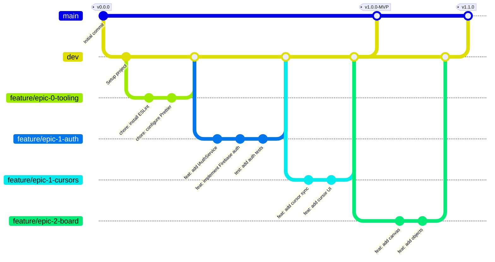
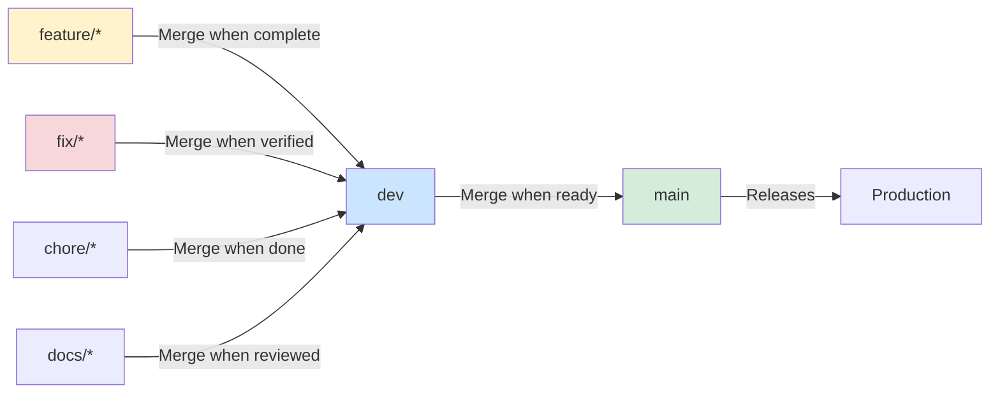
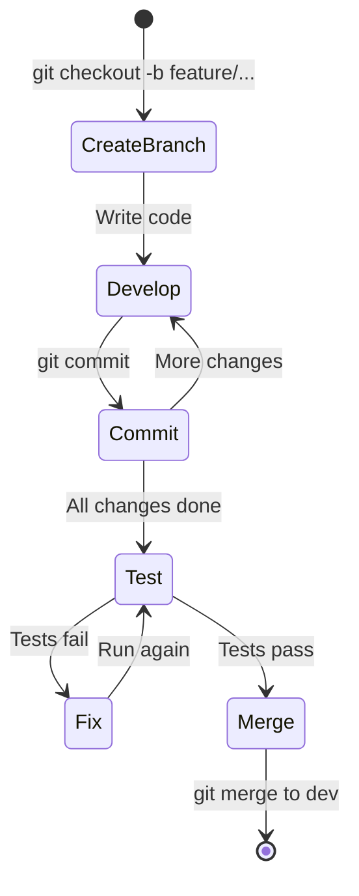
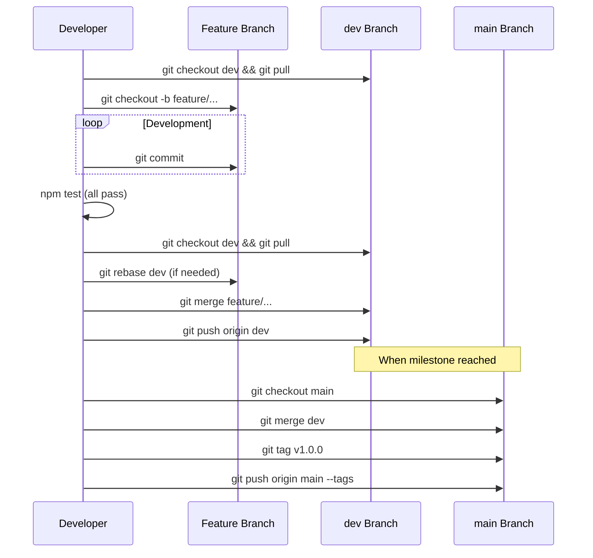

# Git Workflow Guide for CollabBoard

## Overview

This document defines the Git workflow and branching strategy for the CollabBoard project. The workflow is designed to support iterative development with a clear path from feature development to production releases.

---

## Table of Contents

1. [Branch Hierarchy](#1-branch-hierarchy)
2. [Branch Types and Naming](#2-branch-types-and-naming)
3. [Commit Message Convention](#3-commit-message-convention)
4. [Workflow Process](#4-workflow-process)
5. [Merge Strategy](#5-merge-strategy)
6. [Release Process](#6-release-process)
7. [Best Practices](#7-best-practices)

---

## 1. Branch Hierarchy

### 1.1 Branch Structure



### 1.2 Branch Roles

| Branch | Purpose | Protection |
|--------|---------|------------|
| `main` | Production releases only | Protected, requires PR |
| `dev` | Integration branch for features | Semi-protected |
| `feature/*` | New functionality | None |
| `fix/*` | Bug fixes | None |
| `chore/*` | Maintenance tasks | None |
| `docs/*` | Documentation updates | None |

### 1.3 Branch Flow Diagram



---

## 2. Branch Types and Naming

### 2.1 Naming Conventions

| Type | Pattern | Example |
|------|---------|---------|
| Feature | `feature/epic-{N}-{description}` | `feature/epic-1-auth-service` |
| Fix | `fix/{issue-description}` | `fix/cursor-sync-latency` |
| Chore | `chore/{task-description}` | `chore/update-dependencies` |
| Docs | `docs/{topic}` | `docs/api-reference` |
| Hotfix | `hotfix/{critical-issue}` | `hotfix/security-patch` |

### 2.2 Description Guidelines

- Use lowercase letters
- Separate words with hyphens (`-`)
- Keep descriptions concise but meaningful
- Include epic number for feature branches
- Reference issue numbers when applicable

### 2.3 Examples

```bash
# Good branch names
feature/epic-0-project-setup
feature/epic-1-firebase-auth
feature/epic-2-sticky-notes
fix/cursor-position-offset
chore/upgrade-react-18
docs/deployment-guide

# Bad branch names
Feature/Auth                    # Wrong case, too vague
my-feature                      # No type prefix
feature/epicOneAuthSetup        # Wrong format, camelCase
fix-bug                         # Missing slash, too vague
```

---

## 3. Commit Message Convention

### 3.1 Format

```
type(scope): description

[optional body]

[optional footer]
```

### 3.2 Types

| Type | Description | Example |
|------|-------------|---------|
| `feat` | New feature | `feat(auth): add email login` |
| `fix` | Bug fix | `fix(sync): resolve race condition` |
| `docs` | Documentation | `docs(readme): update setup guide` |
| `style` | Formatting only | `style(board): fix indentation` |
| `refactor` | Code restructure | `refactor(ai): extract tool executor` |
| `test` | Add/update tests | `test(auth): add signin tests` |
| `chore` | Maintenance | `chore(deps): update eslint` |
| `perf` | Performance | `perf(canvas): optimize rendering` |

### 3.3 Scopes

| Scope | Module |
|-------|--------|
| `auth` | Authentication module |
| `board` | Board canvas module |
| `sync` | Synchronization module |
| `presence` | Presence/cursor module |
| `ai` | AI agent module |
| `config` | Configuration files |
| `deps` | Dependencies |
| `ci` | CI/CD configuration |

### 3.4 Description Rules

- Use imperative mood ("add" not "added" or "adds")
- Don't capitalize first letter
- No period at the end
- Maximum 72 characters
- Be specific about what changed

### 3.5 Examples

```bash
# Good commits
feat(auth): implement Firebase authentication service
fix(sync): resolve optimistic update race condition
docs(readme): add Firebase setup instructions
test(presence): add multi-user cursor tests
chore(deps): upgrade TypeScript to 5.3
perf(board): implement viewport culling for objects

# Bad commits
Fixed bug                       # No type, vague
feat: stuff                     # No scope, vague
FEAT(AUTH): ADD LOGIN           # Wrong case
feat(auth): Added login feature # Past tense, ends with period
```

### 3.6 Commit Body (Optional)

For complex changes, add a body explaining:

```
feat(ai): implement SWOT template generation

Add createSWOTTemplate tool that generates a 2x2 grid of frames
with Strengths, Weaknesses, Opportunities, and Threats labels.

The tool:
- Creates 4 frame objects with appropriate positions
- Adds text labels to each frame
- Centers the template at the specified coordinates
- Returns all created object IDs

Closes #45
```

---

## 4. Workflow Process

### 4.1 Starting New Work

```bash
# 1. Ensure you're on dev and up to date
git checkout dev
git pull origin dev

# 2. Create feature branch
git checkout -b feature/epic-1-auth-service

# 3. Make changes and commit
git add src/auth/interfaces/IAuthService.ts
git commit -m "feat(auth): define IAuthService interface"

git add src/auth/services/FirebaseAuthService.ts
git commit -m "feat(auth): implement FirebaseAuthService"

git add src/auth/__tests__/auth.test.ts
git commit -m "test(auth): add authentication unit tests"
```

### 4.2 Development Cycle



### 4.3 Completing Work

```bash
# 1. Ensure all tests pass
npm test
npm run test:e2e
npm run lint

# 2. Update from dev (rebase if needed)
git checkout dev
git pull origin dev
git checkout feature/epic-1-auth-service
git rebase dev

# 3. Merge to dev
git checkout dev
git merge feature/epic-1-auth-service

# 4. Push dev
git push origin dev

# 5. Delete feature branch (optional)
git branch -d feature/epic-1-auth-service
```

### 4.4 Workflow Diagram



---

## 5. Merge Strategy

### 5.1 Feature to Dev

- Use regular merge (creates merge commit)
- Preserves feature branch history
- Shows clear integration points

```bash
git checkout dev
git merge feature/epic-1-auth-service
```

### 5.2 Dev to Main

- Use regular merge with tag
- Creates clear release points
- Enables easy rollback

```bash
git checkout main
git merge dev
git tag -a v1.0.0 -m "MVP Release"
git push origin main --tags
```

### 5.3 Handling Conflicts

```bash
# During merge conflict
git merge feature/epic-1-auth-service
# Conflict detected

# 1. Check conflicting files
git status

# 2. Open and resolve each file
# Look for conflict markers: <<<<<<<, =======, >>>>>>>

# 3. Mark as resolved
git add <resolved-file>

# 4. Complete merge
git commit
```

---

## 6. Release Process

### 6.1 Release Checklist

- [ ] All features for release merged to dev
- [ ] All tests pass on dev
- [ ] No linting errors
- [ ] Documentation updated
- [ ] Version number updated (if applicable)
- [ ] Changelog updated

### 6.2 Creating a Release

```bash
# 1. Ensure dev is ready
git checkout dev
npm test
npm run lint
npm run build

# 2. Merge to main
git checkout main
git pull origin main
git merge dev

# 3. Tag the release
git tag -a v1.0.0 -m "MVP Release - Collaborative Infrastructure"

# 4. Push everything
git push origin main
git push origin --tags
```

### 6.3 Version Numbering

Follow Semantic Versioning (SemVer):

| Version | Meaning |
|---------|---------|
| `v1.0.0` | First major release (MVP) |
| `v1.1.0` | New features added |
| `v1.1.1` | Bug fixes only |
| `v2.0.0` | Breaking changes |

### 6.4 Release Tags

```
v1.0.0-MVP      # MVP milestone
v1.0.0-alpha    # Alpha release
v1.0.0-beta     # Beta release
v1.0.0-rc.1     # Release candidate
v1.0.0          # Stable release
```

---

## 7. Best Practices

### 7.1 General Guidelines

1. **Keep branches short-lived**
   - Merge within 1-2 days
   - Break large features into smaller branches

2. **Commit often, push regularly**
   - Small, focused commits
   - Push at end of each work session

3. **Pull before starting work**
   - Always start with latest dev
   - Avoid divergent histories

4. **Write meaningful commits**
   - Follow commit message convention
   - Include context in body when needed

5. **Test before merging**
   - Run full test suite
   - Check for linting errors

### 7.2 Do's and Don'ts

| Do | Don't |
|----|-------|
| Create feature branches from dev | Push directly to main |
| Write descriptive commit messages | Use "WIP" or "fix" as commit messages |
| Pull and rebase regularly | Let branches diverge significantly |
| Delete merged branches | Keep stale branches around |
| Use meaningful branch names | Use personal identifiers in branch names |

### 7.3 Handling Common Scenarios

**Scenario: Forgot to create feature branch**

```bash
# If you've made commits on dev accidentally
git checkout -b feature/my-work  # Create branch with commits
git checkout dev
git reset --hard origin/dev      # Reset dev to remote
git checkout feature/my-work     # Continue on feature branch
```

**Scenario: Need to update feature branch from dev**

```bash
git checkout feature/my-feature
git fetch origin
git rebase origin/dev
# Resolve any conflicts
git push -f origin feature/my-feature  # Force push rebased branch
```

**Scenario: Need to undo last commit**

```bash
# Keep changes, undo commit
git reset --soft HEAD~1

# Discard changes and commit
git reset --hard HEAD~1
```

### 7.4 Pre-Commit Hooks

The project uses Husky for pre-commit hooks:

```bash
# Runs automatically on commit
- ESLint (lint-staged)
- Prettier (lint-staged)
- TypeScript type check
```

If hooks fail, fix the issues before committing:

```bash
# Fix lint issues automatically
npm run lint:fix

# Then try committing again
git commit -m "feat(auth): add login component"
```

---

## Quick Reference

### Commands Cheat Sheet

```bash
# Start new feature
git checkout dev && git pull
git checkout -b feature/epic-X-name

# Commit changes
git add .
git commit -m "type(scope): description"

# Update from dev
git checkout dev && git pull
git checkout feature/my-branch
git rebase dev

# Merge feature
git checkout dev
git merge feature/my-branch
git push origin dev

# Create release
git checkout main
git merge dev
git tag -a vX.Y.Z -m "Release description"
git push origin main --tags
```

### Branch Naming Quick Reference

```
feature/epic-0-project-setup
feature/epic-1-auth-service
feature/epic-1-cursor-sync
feature/epic-2-canvas-setup
feature/epic-2-sticky-notes
feature/epic-3-ai-commands
feature/epic-4-deployment
fix/cursor-latency
fix/sync-conflict
chore/update-deps
docs/api-reference
```

### Commit Types Quick Reference

```
feat     # New feature
fix      # Bug fix
docs     # Documentation
style    # Formatting
refactor # Code restructure
test     # Tests
chore    # Maintenance
perf     # Performance
```

---

## Related Documents

- [Comprehensive PRD](./COMPREHENSIVE-PRD.md)
- [Architecture Document](./ARCHITECTURE.md)

---

## Document History

| Version | Date | Changes |
|---------|------|---------|
| 1.0 | Feb 04, 2026 | Initial git workflow document |
