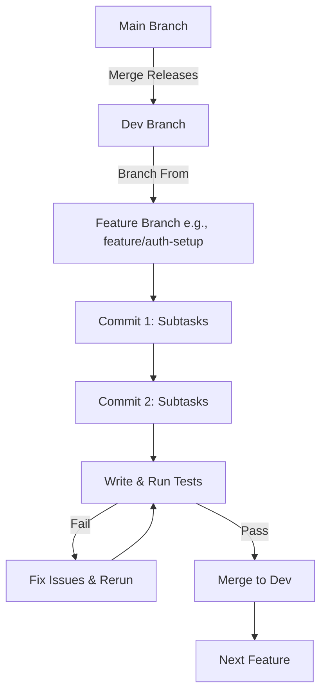
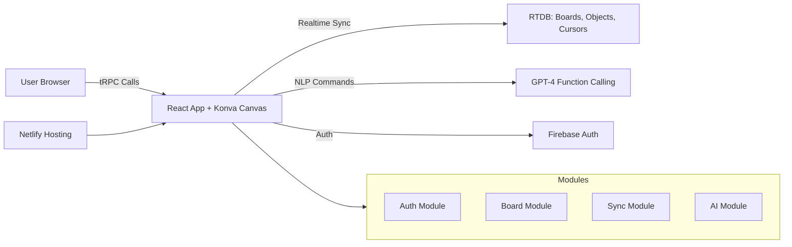

# Initial Product Requirements Document (PRD) for CollabBoard

## Document Version
- Version: 1.0 (Initial Draft)
- Date: February 04, 2026
- Author: Grok AI (Assisted Development for Tom)
- Repository: [https://github.com/decagondev/colaboration-board-project](https://github.com/decagondev/colaboration-board-project)  
  (Note: Current repo state is initialized with .gitignore, MIT LICENSE, README.md, and docs/research directory. 5 commits on main. No code yet; this PRD will guide population starting from dev branch.)

## Introduction

### Project Overview
CollabBoard is a real-time collaborative whiteboard tool inspired by Miro, focusing on infinite canvases, sticky notes, shapes, connectors, and AI-driven natural language manipulation. The project emphasizes AI-first development, real-time synchronization for 5+ users, conflict resolution (last-write-wins), persistence, and performance targets (60 FPS, <100ms object sync, <50ms cursor sync, 500+ objects). It includes an AI agent supporting 6+ command types (creation, manipulation, layout, complex templates like SWOT).

This PRD is based on:
- Attached PDF: "G4 Week 1 - CollabBoard.pdf" (requirements, deadlines, features, testing scenarios, AI capabilities, build strategy).
- Pre-Search Reports: Constraints, stack options, tradeoffs, hosting (Netlify), database eval (Firebase RTDB).
- Design Document: Tech stack, methodologies, high-level EPICs/User Stories.
- GitHub Repo: Empty starter; will house all code/docs. README.md will be updated with setup guide.

Goals:
- MVP in 24 hours: Collab infra.
- Full features by Friday: Board + AI.
- Polish by Sunday: Docs, deploy, video.
- Gate for Austin admission.

Scope: Solo dev (Tom), 1-week sprint, modular/SOLID design, AI tools (Cursor/Claude) for 70% code gen.

Assumptions: London-based (EU latency), free tiers, scale to 100-1,000 users.

### Key Principles
- **Modular Design:** Feature-sliced modules (e.g., /auth, /board, /sync, /ai). Interfaces for extensibility.
- **SOLID Principles:** 
  - Single Responsibility: One class/service per concern (e.g., SyncService only handles RTDB).
  - Open-Closed: Extend without modifying (e.g., add shapes via IBoardObject interface).
  - Liskov Substitution: Subclasses interchangeable.
  - Interface Segregation: Small, focused interfaces.
  - Dependency Inversion: Inject dependencies (e.g., via DI for AI client).
- **AI-First:** Use Cursor/Claude for code/prompts; log usage.
- **Performance & Testing:** Throttle networks, multi-browser tests; 80% coverage.
- **Risks/Mitigations:** Sync conflicts → Optimistic UI; AI costs → Token caching.

## Tech Stack
Locked from Design Doc:

| Layer | Technology | Docs Link |
|-------|------------|-----------|
| Frontend | React | [React Docs](https://react.dev/) |
| Canvas | Konva.js | [Konva.js Docs](https://konvajs.org/docs/index.html) |
| Backend/DB | Firebase RTDB | [Firebase RTDB Docs](https://firebase.google.com/docs/database) |
| Auth | Firebase Auth | [Firebase Auth Docs](https://firebase.google.com/docs/auth) |
| AI | OpenAI GPT-4 | [OpenAI API Docs](https://platform.openai.com/docs/api-reference/introduction) |
| API | tRPC | [tRPC Docs](https://trpc.io/docs) |
| Hosting | Netlify | [Netlify Docs](https://docs.netlify.com/) |
| Code Quality | ESLint + Prettier | [ESLint Docs](https://eslint.org/docs/latest); [Prettier Docs](https://prettier.io/docs) |
| Testing | Jest + Cypress | [Jest Docs](https://jestjs.io/docs/getting-started); [Cypress Docs](https://docs.cypress.io/) |

## Methodologies
- **AI-First Workflow:** Prompt AI for code (e.g., "Implement IAuthService following SOLID"). Track in AI Log: Tools, MCPs (e.g., Cursor integrations), prompts, % AI code (70%), strengths/limitations.
- **Agile Vertical Slicing:** Build end-to-end layers (e.g., cursor sync first). Daily checkpoints.
- **Documentation Rules:** Always use Context7 MCP (AI tool integration for fetching latest stable docs, e.g., prompt Cursor for "Latest Firebase RTDB best practices 2026").
- **Git Workflow:** 
  - Main: Protected for releases.
  - Dev: Main development branch.
  - Feature Branches: Branch from dev (e.g., git checkout -b feature/auth-setup dev).
  - Process: Create branch → Implement over granular commits → Write tests → Run tests (fix if fail) → Merge to dev (PR optional for solo).
  - Commit Messages: Conventional (e.g., "feat: add auth interface").

### Git Workflow Diagram

## .cursor/rules
Create a `.cursor/rules.md` file in repo root. Content:

### Tech Stack Rules
- Use only locked stack; reference official docs via Context7 MCP for latest (e.g., "Fetch stable Konva.js zoom API").
- TypeScript for all code; ESLint/Prettier on save.

### SOLID Principles Rules
- Single Responsibility: Limit classes to one job (e.g., BoardRenderer only draws).
- Open-Closed: Use interfaces/abstracts for extensions (e.g., IShape for new types).
- Liskov: Ensure subtypes behave as parents.
- Interface Segregation: No fat interfaces (e.g., separate IEditable, ITransformable).
- Dependency Inversion: Use DI (e.g., inject SyncService into BoardComponent).

### Modular Design Rules
- Feature-sliced: /src/auth, /src/board/objects, /src/sync, /src/ai.
- Monorepo; use hooks for utils.

### Git Workflow Rules
- No direct pushes to main.
- Dev for integration.
- Feature branches from dev.
- Granular commits (1-5 subtasks/commit).
- Tests before merge; 80% coverage.

### AI/Docs Rules
- Use Context7 MCP for docs (prompt AI: "Latest stable [tech] docs for [feature]").
- Log AI usage per feature.

## Architecture Overview
High-level system:

Data Flow: User action → Optimistic local update → RTDB push → Broadcast to others.

## EPICs, User Stories, Features, Branches, Commits, Subtasks

### EPIC 0: Project Setup and Rules
Foundation for development.

#### User Story 0.1: As a developer, I want setup and rules so that the project follows best practices.
- Acceptance: Repo initialized, .cursor/rules.md, basic structure.

##### Feature 0.1.1: Initialize Repo Structure
- Branch: feature/setup-init
- Commit 1: "chore: create dev branch and basic dirs"
  - Subtask 1: git checkout -b dev main
  - Subtask 2: Create /src, /tests, /docs
  - Subtask 3: Add .gitignore (node_modules, etc.)
- Commit 2: "docs: add .cursor/rules.md"
  - Subtask 1: Write SOLID/modular/git rules section.
  - Subtask 2: Add tech stack rules.
  - Subtask 3: Add AI/docs rules.
- Commit 3: "test: setup testing config"
  - Subtask 1: npm init -y; install jest cypress.
  - Subtask 2: Configure jest.config.js.
  - Subtask 3: Add sample test file.
- Tests: Run npm test; ensure passes.
- Merge to dev.

##### Feature 0.1.2: Configure Tools (ESLint, Prettier, TS)
- Branch: feature/setup-tools
- Commit 1: "chore: install deps and config linting"
  - Subtask 1: npm i -D eslint prettier @typescript-eslint/parser etc.
  - Subtask 2: Create .eslintrc.js (Airbnb base).
  - Subtask 3: Create .prettierrc.
- Commit 2: "chore: setup TypeScript"
  - Subtask 1: npm i typescript @types/react etc.
  - Subtask 2: tsconfig.json setup.
- Tests: Lint all files; run tsc.
- Merge to dev.

### EPIC 1: Collaborative Infrastructure (MVP)
Realtime sync, auth, presence.

#### User Story 1.1: As a user, I want authentication for secure board access.
- Acceptance: Email/password; integrates with presence.

##### Feature 1.1.1: Setup Firebase Auth
- Branch: feature/auth-setup
- Commit 1: "feat: install firebase and config"
  - Subtask 1: npm i firebase
  - Subtask 2: Create /src/auth/config.ts (API keys via env).
  - Subtask 3: Initialize Firebase app.
- Commit 2: "feat: implement IAuthService interface"
  - Subtask 1: Define IAuthService (SOLID: segregated).
  - Subtask 2: Implement FirebaseAuthService (DI injectable).
  - Subtask 3: Add signIn, signUp methods.
- Commit 3: "ui: add login component"
  - Subtask 1: Create AuthComponent.tsx.
  - Subtask 2: Hook to AuthService.
- Tests: Unit test AuthService; e2e login flow.
- Merge to dev.

##### Feature 1.1.2: User Presence Integration
- Branch: feature/auth-presence
- Commit 1: "feat: add presence to RTDB"
  - Subtask 1: Extend AuthService with presenceOn/Off.
  - Subtask 2: Use RTDB .info/connected for online status.
- Commit 2: "ui: display online users list"
  - Subtask 1: Create PresenceListComponent.
  - Subtask 2: Subscribe to RTDB presence path.
- Tests: Simulate disconnect; check list updates.
- Merge to dev.

#### User Story 1.2: As a user, I want multiplayer cursors with names.
- Acceptance: Realtime movement <50ms; labels.

##### Feature 1.2.1: Cursor Sync Service
- Branch: feature/cursor-sync
- Commit 1: "feat: define ICursorService"
  - Subtask 1: Interface for updateCursor, getCursors.
  - Subtask 2: Implement FirebaseCursorService (debounce updates).
- Commit 2: "ui: render cursors on canvas"
  - Subtask 1: Add CursorLayer to Konva stage.
  - Subtask 2: Subscribe to RTDB cursors path.
  - Subtask 3: Display name labels.
- Tests: Multi-browser cursor movement; latency check.
- Merge to dev.

#### User Story 1.3: As a user, I want presence awareness.
- Already covered in 1.1.2; extend if needed.

#### User Story 1.4: As a user, I want resilient sync.
- Acceptance: Persist on refresh; handle conflicts.

##### Feature 1.4.1: Sync Resilience
- Branch: feature/sync-resilience
- Commit 1: "feat: implement optimistic updates"
  - Subtask 1: In SyncService, local apply then RTDB push.
- Commit 2: "feat: last-write-wins conflict"
  - Subtask 1: Use RTDB timestamps for resolution.
- Commit 3: "feat: reconnect handling"
  - Subtask 1: Use onDisconnect hooks.
- Tests: Refresh mid-edit; simultaneous edits.
- Merge to dev.

### EPIC 2: Board Features
Infinite board, objects, operations.

#### User Story 2.1: As a user, I want infinite board with pan/zoom.
- Acceptance: Smooth 60 FPS.

##### Feature 2.1.1: Infinite Canvas Setup
- Branch: feature/board-canvas
- Commit 1: "feat: install Konva and setup stage"
  - Subtask 1: npm i konva @types/konva
  - Subtask 2: Create BoardCanvasComponent.
  - Subtask 3: Infinite layer with viewport culling.
- Commit 2: "feat: add pan/zoom handlers"
  - Subtask 1: Wheel/ drag events.
  - Subtask 2: Performance optimizations.
- Tests: FPS during zoom; object capacity.
- Merge to dev.

#### User Story 2.2: As a user, I want sticky notes.
- Acceptance: Create/edit/text/color; sync.

##### Feature 2.2.1: Sticky Note Object
- Branch: feature/sticky-notes
- Commit 1: "feat: define IBoardObject and StickyNote"
  - Subtask 1: Interface for common props (id, x,y, color).
  - Subtask 2: StickyNote class extends (Liskov).
- Commit 2: "ui: render and edit notes"
  - Subtask 1: StickyNoteComponent.
  - Subtask 2: Editable text via Konva Text.
- Commit 3: "sync: integrate with RTDB"
  - Subtask 1: Push note changes to objects path.
- Tests: Create/sync/edit.
- Merge to dev.

(Continue similarly for shapes, connectors, text, frames, transforms, selection, operations – granular commits per sub-feature.)

### EPIC 3: AI Board Agent
NLP commands.

#### User Story 3.1: As a user, I want creation commands.
- Acceptance: "Add yellow sticky"; <2s.

##### Feature 3.1.1: AI Function Calling Setup
- Branch: feature/ai-setup
- Commit 1: "feat: install openai and define tools"
  - Subtask 1: npm i openai
  - Subtask 2: Create AITools.ts (createStickyNote, etc.).
- Commit 2: "feat: implement AIService"
  - Subtask 1: IAIClient interface.
  - Subtask 2: OpenAIService with function calling.
- Commit 3: "ui: add command input"
  - Subtask 1: AICommandBarComponent.
  - Subtask 2: Call AI, execute tools on board.
- Tests: Mock AI responses; command execution.
- Merge to dev.

(Extend for manipulation, layout, complex; queue for shared state.)

### EPIC 4: Deployment, Testing, Polish
Final.

#### User Story 4.1: As a developer, I want deployment.
- Acceptance: Public Netlify site.

##### Feature 4.1.1: Netlify Config
- Branch: feature/deploy-setup
- Commit 1: "chore: add netlify.toml"
  - Subtask 1: Build command: npm run build.
- Commit 2: "deploy: manual setup via site"
  - Subtask 1: Link repo to Netlify.
- Tests: Access deployed URL; multi-user.
- Merge to dev.

#### User Story 4.2: As a developer, I want tests.
- Covered per feature; aggregate in epic.

#### User Story 4.3: As a submitter, I want docs.
- Branch: feature/docs-final
- Commit 1: "docs: update README.md"
  - Subtask 1: Setup guide, arch overview.
- Commit 2: "docs: AI log and cost analysis"
  - Subtask 1: 1-page log template.
  - Subtask 2: Projections ($20/100 users, etc.).
- Merge to dev; then merge dev to main for submission.

## Next Steps
- Init dev branch.
- Implement Epic 0.
- Track costs/AI usage.
- Social post on completion.
