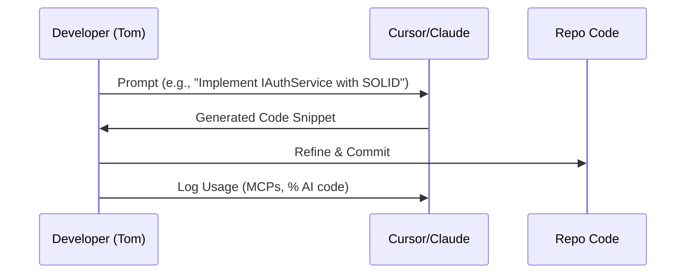
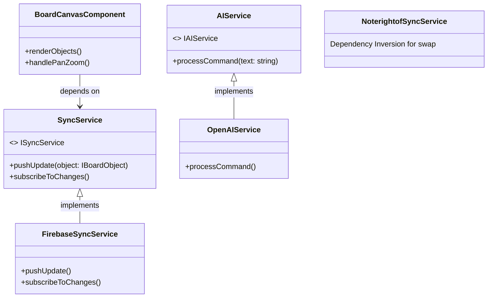
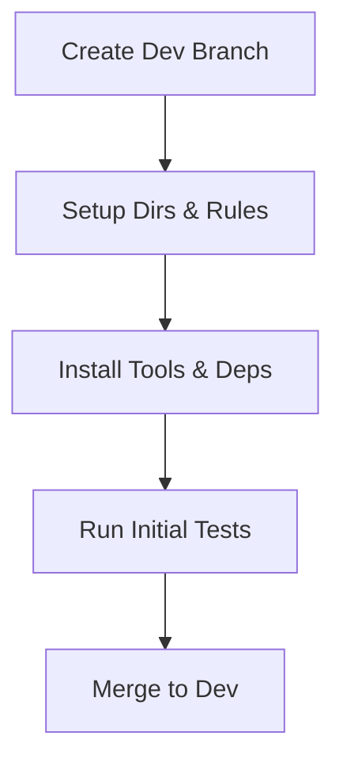
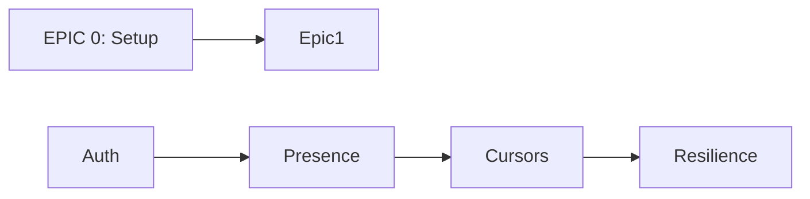
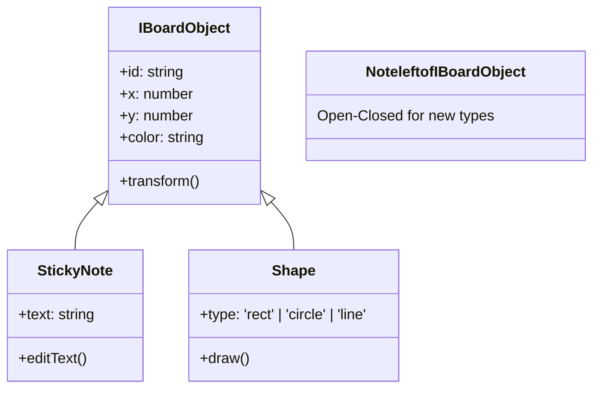
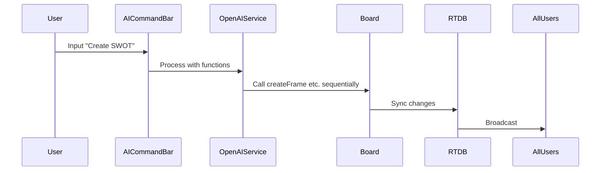
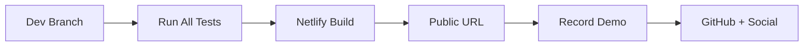

# Updated Product Requirements Document (PRD) for CollabBoard

## Document Version
- Version: 1.1 (Expanded Draft)
- Date: February 04, 2026
- Author: Grok AI (Assisted Development for Tom)
- Repository: [https://github.com/decagondev/colaboration-board-project](https://github.com/decagondev/colaboration-board-project)  
  (Note: Repo is initialized with .gitignore, MIT LICENSE, README.md, and docs/research directory. This expanded PRD elaborates on EPICs with deeper descriptions, dependencies, risks/mitigations, performance considerations, and additional Mermaid diagrams for visualization. It aligns with PDF requirements, Pre-Search, and Design Doc.)

## Introduction

### Project Overview
CollabBoard builds a production-scale collaborative whiteboard with real-time sync, multiplayer features, and an AI agent for natural language board manipulation. Drawing from Miro's inspiration, it handles infinite canvases, object creation/editing, conflict resolution, and AI commands (e.g., "Create a SWOT analysis" generating labeled quadrants). Key emphases: AI-first workflows (using Cursor/Claude for code gen), modularity for extensibility, SOLID for maintainable code, and vertical slicing for rapid iteration.

Expanded Scope: This version elaborates EPICs with sub-dependencies, testing scenarios from PDF (e.g., multi-browser edits, network throttling), performance metrics (e.g., 500+ objects without drops), and cost projections. Risks include sync latency (mitigated by optimistic UI) and AI reliability (mitigated by function calling schemas).

Assumptions: Solo dev in London (EU Firebase region for <50ms latency), free tiers, 1-week sprint (MVP Tuesday, full Friday, final Sunday).

### Key Principles
- **Modular Design:** Decoupled modules (e.g., /auth isolated from /board); use facades for inter-module communication.
- **SOLID Principles:** Enforced per commit (e.g., no god classes; DI for all services).
- **AI-First:** 70% code from prompts; log MCP usage (e.g., Context7 for docs).
- **Performance & Testing:** Network throttling in Cypress; multi-user simulations.
- **Risks/Mitigations:** Vendor lock-in → Interfaces for swaps; scale issues → Free-tier monitoring.

## Tech Stack
(Unchanged from v1.0; references fetched via Context7 MCP for 2026 stability.)

| Layer | Technology | Docs Link |
|-------|------------|-----------|
| Frontend | React | [React Docs](https://react.dev/) |
| Canvas | Konva.js | [Konva.js Docs](https://konvajs.org/docs/index.html) |
| Backend/DB | Firebase RTDB | [Firebase RTDB Docs](https://firebase.google.com/docs/database) |
| Auth | Firebase Auth | [Firebase Auth Docs](https://firebase.google.com/docs/auth) |
| AI | OpenAI GPT-4 | [OpenAI API Docs](https://platform.openai.com/docs/api-reference/introduction) |
| API | tRPC | [tRPC Docs](https://trpc.io/docs) |
| Hosting | Netlify | [Netlify Docs](https://docs.netlify.com/) |
| Code Quality | ESLint + Prettier | [ESLint Docs](https://eslint.org/docs/latest); [Prettier Docs](https://prettier.io/docs) |
| Testing | Jest + Cypress | [Jest Docs](https://jestjs.io/docs/getting-started); [Cypress Docs](https://docs.cypress.io/) |

## Methodologies
(Unchanged; expanded with diagram for AI workflow.)

### AI Workflow Diagram

## .cursor/rules
(Unchanged; commit to repo in Epic 0.)

## Architecture Overview
Expanded with component diagram.

Data Flow: User → Local Optimistic → tRPC/RTDB → Broadcast.

## EPICs, User Stories, Features, Branches, Commits, Subtasks

### EPIC 0: Project Setup and Rules
**Description:** Establishes foundation: Repo structure, tools, rules for SOLID/modular/git. Dependencies: None (starting point). Risks: Misconfigs leading to lint errors (mitigate: Auto-format). Performance: N/A. Timeline: Hours 1-2.

**Epic Flow Diagram**

#### User Story 0.1: As a developer, I want setup and rules for best practices.
- Acceptance: Structure ready; rules enforced.
- Dependencies: Git init.
- Risks: Incompatible deps (mitigate: Pin versions).

##### Feature 0.1.1: Initialize Repo Structure
- Branch: feature/setup-init
- Commit 1: "chore: create dev branch and basic dirs"
  - Subtask 1: git checkout -b dev main
  - Subtask 2: mkdir src tests docs/research
  - Subtask 3: Update .gitignore for node_modules, .env, dist
  - Subtask 4: Commit with conventional message
- Commit 2: "docs: add .cursor/rules.md"
  - Subtask 1: Write SOLID section (e.g., "Use DI for all services")
  - Subtask 2: Add modular rules (e.g., "Feature-sliced folders")
  - Subtask 3: Include git workflow (no main pushes)
  - Subtask 4: Add AI rules (Context7 MCP for docs)
- Commit 3: "test: setup testing config"
  - Subtask 1: npm init -y
  - Subtask 2: npm i -D jest cypress ts-jest @types/jest
  - Subtask 3: Configure jest.config.ts (modules: true)
  - Subtask 4: Add cypress.config.ts
- Tests: npm test (empty passes); cypress open (setup verifies).
- Merge to dev (git merge feature/setup-init dev).

##### Feature 0.1.2: Configure Tools (ESLint, Prettier, TS)
- Branch: feature/setup-tools
- Commit 1: "chore: install deps and config linting"
  - Subtask 1: npm i -D eslint prettier eslint-config-airbnb eslint-plugin-react @typescript-eslint/eslint-plugin
  - Subtask 2: Create .eslintrc.js (extends: airbnb, rules for React/TS)
  - Subtask 3: Create .prettierrc (semi: true, singleQuote: true)
  - Subtask 4: Add vscode settings.json for auto-format
- Commit 2: "chore: setup TypeScript"
  - Subtask 1: npm i typescript @types/react @types/react-dom @types/node
  - Subtask 2: tsc --init (strict: true, module: esnext)
  - Subtask 3: Add tsconfig.json paths for modules
- Commit 3: "chore: add husky for pre-commit"
  - Subtask 1: npm i -D husky
  - Subtask 2: npx husky-init
  - Subtask 3: Add lint-staged for eslint --fix
- Tests: npx eslint .; npx prettier --check .; tsc --noEmit
- Merge to dev.

### EPIC 1: Collaborative Infrastructure (MVP)
**Description:** Builds core realtime: Auth, cursors, presence, sync resilience. Focus on PDF MVP (24-hour gate): Bulletproof multiplayer over features. Dependencies: Epic 0. Risks: Latency spikes (mitigate: Debounce, client prediction). Performance: <50ms cursors, handle 5+ users. Testing: Multi-browser, throttling. Timeline: Hours 3-24.

**Epic Dependency Diagram**

#### User Story 1.1: As a user, I want authentication for secure board access.
- Acceptance: Email/password/social; ties to presence. PDF: Required for MVP.
- Dependencies: Firebase setup.
- Risks: Token leaks (mitigate: Env vars, rules).

##### Feature 1.1.1: Setup Firebase Auth
- Branch: feature/auth-setup
- Commit 1: "feat: install firebase and config"
  - Subtask 1: npm i firebase
  - Subtask 2: Create /src/auth/config.ts (initializeApp with env vars)
  - Subtask 3: Setup .env.example for FIREBASE_API_KEY etc.
  - Subtask 4: Add Firebase console setup note in README
- Commit 2: "feat: implement IAuthService interface"
  - Subtask 1: Define /src/auth/IAuthService.ts (methods: signIn, signOut, getUser)
  - Subtask 2: Implement FirebaseAuthService.ts (uses getAuth())
  - Subtask 3: Use DI pattern (export factory function)
  - Subtask 4: Handle errors with try/catch
- Commit 3: "ui: add login component"
  - Subtask 1: Create /src/components/Auth/LoginComponent.tsx (React form)
  - Subtask 2: Use useState for email/password
  - Subtask 3: Call AuthService.signIn on submit
  - Subtask 4: Redirect to board on success
- Tests: Jest unit for AuthService (mock firebase); Cypress e2e for login flow (simulate user).
- Merge to dev.

##### Feature 1.1.2: User Presence Integration
- Branch: feature/auth-presence
- Commit 1: "feat: add presence to RTDB"
  - Subtask 1: Extend IAuthService with setPresence()
  - Subtask 2: Use RTDB ref('presence/' + userId).set(true) on login
  - Subtask 3: onDisconnect().remove() for offline
  - Subtask 4: Use .info/connected listener
- Commit 2: "ui: display online users list"
  - Subtask 1: Create /src/components/Presence/PresenceListComponent.tsx
  - Subtask 2: Use onValue(ref('presence')) to subscribe
  - Subtask 3: Render user names (fetch from auth)
  - Subtask 4: Update realtime
- Commit 3: "feat: integrate with auth lifecycle"
  - Subtask 1: In App.tsx, use onAuthStateChanged to trigger presence
  - Subtask 2: Handle anonymous auth fallback
- Tests: Cypress: Login two users, check list; simulate disconnect.
- Merge to dev.

#### User Story 1.2: As a user, I want multiplayer cursors with names.
- Acceptance: Realtime movement, labels; <50ms. PDF: MVP required.
- Dependencies: Auth, Canvas setup (parallel with Epic 2).
- Risks: Perf drops (mitigate: Throttle to 50ms updates).

##### Feature 1.2.1: Cursor Sync Service
- Branch: feature/cursor-sync
- Commit 1: "feat: define ICursorService"
  - Subtask 1: /src/sync/ICursorService.ts (updatePosition, getAllCursors)
  - Subtask 2: Implement FirebaseCursorService.ts (ref('cursors/' + userId))
  - Subtask 3: Debounce updates with lodash (npm i lodash)
  - Subtask 4: Include user name from auth
- Commit 2: "ui: render cursors on canvas"
  - Subtask 1: In BoardCanvasComponent, add Konva.Group for cursors
  - Subtask 2: onValue(ref('cursors')) to update positions
  - Subtask 3: Render arrow + Text for name
  - Subtask 4: Handle viewport (only render visible)
- Commit 3: "feat: capture mouse events"
  - Subtask 1: onMouseMove in canvas, call updatePosition
  - Subtask 2: Transform coords to world space
- Tests: Jest for service; Cypress multi-browser cursor tracking.
- Merge to dev.

#### User Story 1.3: As a user, I want presence awareness.
- Acceptance: Online list; updates instantly. PDF: MVP.
- Dependencies: 1.1.
- Risks: Stale data (mitigate: Realtime listeners).

##### Feature 1.3.1: Enhanced Presence UI
- Branch: feature/presence-ui
- Commit 1: "ui: style presence list"
  - Subtask 1: Add CSS module for PresenceList
  - Subtask 2: Show avatars if available (from auth)
- Commit 2: "feat: notify on join/leave"
  - Subtask 1: Use child_added/removed events
  - Subtask 2: Toast notifications (npm i react-toastify)
- Tests: Cypress: User join/leave simulation.
- Merge to dev.

#### User Story 1.4: As a user, I want resilient sync.
- Acceptance: Persist state; handle conflicts/disconnects. PDF: Testing scenarios 2-4.
- Dependencies: All of Epic 1.
- Risks: Data loss (mitigate: LocalStorage fallback).

##### Feature 1.4.1: Sync Resilience
- Branch: feature/sync-resilience
- Commit 1: "feat: implement optimistic updates"
  - Subtask 1: In SyncService, apply local then async push
  - Subtask 2: Rollback on failure
- Commit 2: "feat: last-write-wins conflict"
  - Subtask 1: Add timestamp to objects
  - Subtask 2: On conflict, compare timestamps
- Commit 3: "feat: reconnect handling"
  - Subtask 1: Use goOnline/goOffline
  - Subtask 2: Resync full state on reconnect
- Commit 4: "test: add network throttling"
  - Subtask 1: In Cypress, use cy.throttleNetwork
- Tests: Cypress: Refresh, disconnect recovery; simultaneous edits.
- Merge to dev.

### EPIC 2: Board Features
**Description:** Core whiteboard: Infinite space, objects (notes, shapes, etc.), transforms, selection. PDF: Full set by Friday. Dependencies: Epic 1 (sync). Risks: Perf with 500 objects (mitigate: Virtualization in Konva). Performance: 60 FPS pan/zoom. Testing: Rapid creation (scenario 3). Timeline: Days 2-4.

**Object Hierarchy Diagram**

#### User Story 2.1: As a user, I want infinite board with pan/zoom.
- Acceptance: Smooth navigation; PDF workspace req.
- Dependencies: Konva install.
- Risks: Zoom artifacts (mitigate: Scale transforms).

##### Feature 2.1.1: Infinite Canvas Setup
- Branch: feature/board-canvas
- Commit 1: "feat: install Konva and setup stage"
  - Subtask 1: npm i konva @types/konva
  - Subtask 2: Create /src/board/BoardCanvasComponent.tsx
  - Subtask 3: Konva.Stage with infinite Layer
  - Subtask 4: Add viewport culling logic
- Commit 2: "feat: add pan/zoom handlers"
  - Subtask 1: onWheel for zoom (scaleBy: 1.05)
  - Subtask 2: onDrag for pan
  - Subtask 3: Limit zoom min/max
  - Subtask 4: Perf profile (use Konva hitGraphEnabled false)
- Tests: Cypress: Pan/zoom FPS; object visibility.
- Merge to dev.

##### Feature 2.1.2: Board State Management
- Branch: feature/board-state
- Commit 1: "feat: define IBoardState"
  - Subtask 1: Interface for objects array, view (x,y,scale)
  - Subtask 2: Use React Context for state
- Commit 2: "sync: integrate board state with RTDB"
  - Subtask 1: ref('boards/default') for persistence
  - Subtask 2: onValue to load initial
- Tests: State persistence on load.
- Merge to dev.

#### User Story 2.2: As a user, I want sticky notes.
- Acceptance: Create/edit/text/color; sync <100ms. PDF: Core feature.
- Dependencies: 2.1.
- Risks: Text editing conflicts (mitigate: Lock during edit).

##### Feature 2.2.1: Sticky Note Object
- Branch: feature/sticky-notes
- Commit 1: "feat: define IBoardObject and StickyNote"
  - Subtask 1: /src/board/objects/IBoardObject.ts (common props)
  - Subtask 2: StickyNote.ts extends IBoardObject (text prop)
  - Subtask 3: Factory for creation
- Commit 2: "ui: render and edit notes"
  - Subtask 1: StickyNoteComponent.tsx (Konva.Rect + Text)
  - Subtask 2: onDblClick for editable input
  - Subtask 3: Color picker integration
- Commit 3: "sync: integrate with RTDB"
  - Subtask 1: Push to ref('objects/' + id)
  - Subtask 2: Optimistic create
- Commit 4: "feat: add create tool"
  - Subtask 1: Toolbar button for new note
  - Subtask 2: Position at cursor
- Tests: Create/edit/sync; multi-user edit.
- Merge to dev.

#### User Story 2.3: As a user, I want shapes (rect, circle, line).
- Acceptance: Solid colors; transforms. PDF: At least one for MVP.
- Dependencies: 2.1.
- Risks: Drawing precision (mitigate: Snap to grid).

##### Feature 2.3.1: Shape Objects
- Branch: feature/shapes
- Commit 1: "feat: extend IBoardObject for shapes"
  - Subtask 1: Shape.ts (type, width, height)
  - Subtask 2: Subclasses for Rect, Circle, Line
- Commit 2: "ui: render shapes"
  - Subtask 1: ShapeComponent.tsx (switch on type)
  - Subtask 2: Konva shapes with fill
- Commit 3: "feat: drawing mode"
  - Subtask 1: onMouseDown/start draw
  - Subtask 2: onMouseUp/finish
- Commit 4: "sync: shape updates"
  - Subtask 1: Real-time position changes
- Tests: Create different types; sync.
- Merge to dev.

#### User Story 2.4: As a user, I want connectors/frames/text.
- Acceptance: Links, groups, standalone text. PDF: Full set.
- Dependencies: 2.3.
- Risks: Connector rerouting (mitigate: Simple lines for MVP).

##### Feature 2.4.1: Connectors
- Branch: feature/connectors
- Commit 1: "feat: Connector class"
  - Subtask 1: Extends IBoardObject (fromId, toId, style: arrow)
  - Subtask 2: Konva.Line for render
- Commit 2: "ui: create connectors"
  - Subtask 1: Drag from object to object
  - Subtask 2: Update on move
- Commit 3: "sync: connector state"
  - Subtask 1: Store in RTDB
- Tests: Connect/disconnect.
- Merge to dev.

##### Feature 2.4.2: Frames and Text
- Branch: feature/frames-text
- Commit 1: "feat: Frame and Text classes"
  - Subtask 1: Frame: Group container
  - Subtask 2: Text: Standalone editable
- Commit 2: "ui: render and group"
  - Subtask 1: Konva.Group for frames
  - Subtask 2: Add to toolbar
- Commit 3: "sync: group persistence"
  - Subtask 1: Nested objects in RTDB
- Tests: Group/ungroup.
- Merge to dev.

#### User Story 2.5: As a user, I want selection/operations.
- Acceptance: Multi-select, delete/duplicate. PDF: Operations.
- Dependencies: All of 2.
- Risks: Select perf (mitigate: Hit detection opt).

##### Feature 2.5.1: Selection Tools
- Branch: feature/selection
- Commit 1: "feat: ISelectable interface"
  - Subtask 1: Add to IBoardObject
  - Subtask 2: SelectionService for multi
- Commit 2: "ui: shift-click and drag select"
  - Subtask 1: Konva.Transformer for handles
  - Subtask 2: Lasso select
- Commit 3: "ops: delete/duplicate/copy"
  - Subtask 1: Keyboard shortcuts
  - Subtask 2: Sync operations
- Tests: Multi-ops sync.
- Merge to dev.

### EPIC 3: AI Board Agent
**Description:** NLP agent for 6+ commands across categories. PDF: Required capabilities, tool schema, evaluation (e.g., SWOT quadrants). Dependencies: Epic 2 (board state). Risks: Multi-step failures (mitigate: Sequential execution). Performance: <2s response. Testing: Simultaneous commands. Timeline: Days 4-6.

**AI Command Flow Diagram**

#### User Story 3.1: As a user, I want creation commands.
- Acceptance: "Add yellow sticky"; uses schema. PDF: Creation examples.
- Dependencies: Objects.
- Risks: Invalid positions (mitigate: Default coords).

##### Feature 3.1.1: AI Function Calling Setup
- Branch: feature/ai-setup
- Commit 1: "feat: install openai and define tools"
  - Subtask 1: npm i openai
  - Subtask 2: /src/ai/AITools.ts (createStickyNote, etc. per PDF schema)
  - Subtask 3: JSON schema for GPT
- Commit 2: "feat: implement IAIService"
  - Subtask 1: Interface for processCommand
  - Subtask 2: OpenAIService.ts (chat.completions.create with tools)
  - Subtask 3: Handle multi-tool calls
- Commit 3: "ui: add command input"
  - Subtask 1: AICommandBarComponent.tsx
  - Subtask 2: Input field, submit to AI
  - Subtask 3: Display thinking state
- Commit 4: "feat: integrate getBoardState"
  - Subtask 1: Tool to return current objects for context
- Tests: Mock OpenAI; command parsing.
- Merge to dev.

##### Feature 3.1.2: Basic Creation Execution
- Branch: feature/ai-creation
- Commit 1: "feat: execute creation tools"
  - Subtask 1: Map tool calls to board actions
  - Subtask 2: Add to state/sync
- Tests: "Add sticky" creates object.
- Merge to dev.

#### User Story 3.2: As a user, I want manipulation commands.
- Acceptance: "Move pink notes"; PDF examples.
- Dependencies: 3.1.
- Risks: Ambiguous selectors (mitigate: AI reasoning).

##### Feature 3.2.1: Manipulation Tools
- Branch: feature/ai-manipulation
- Commit 1: "feat: add move/resize/changeColor tools"
  - Subtask 1: Update schema
  - Subtask 2: Implement in AITools
- Commit 2: "feat: select objects by color/text"
  - Subtask 1: Query board state
  - Subtask 2: Batch updates
- Tests: "Change color" syncs.
- Merge to dev.

#### User Story 3.3: As a user, I want layout/complex commands.
- Acceptance: "Arrange in grid"; "Create SWOT". PDF: Multi-step.
- Dependencies: 3.2.
- Risks: Complex planning (mitigate: AI multi-call).

##### Feature 3.3.1: Layout Tools
- Branch: feature/ai-layout
- Commit 1: "feat: add arrangeGrid, spaceEvenly"
  - Subtask 1: Tools for positioning
- Commit 2: "feat: template generators"
  - Subtask 1: SWOT: Create 4 frames with labels
  - Subtask 2: User journey: 5 stages
- Tests: Template commands.
- Merge to dev.

#### User Story 3.4: As a user, I want shared AI state.
- Acceptance: Realtime results; no conflicts. PDF: Shared state.
- Dependencies: All of 3.
- Risks: Race conditions (mitigate: Queue).

##### Feature 3.4.1: AI Queueing
- Branch: feature/ai-shared
- Commit 1: "feat: command queue in RTDB"
  - Subtask 1: ref('ai-queue') for pending
  - Subtask 2: Process sequentially
- Commit 2: "ui: show AI processing"
  - Subtask 1: Global loader
- Tests: Simultaneous commands from users.
- Merge to dev.

### EPIC 4: Deployment, Testing, and Polish
**Description:** Finalize: Deploy, comprehensive tests, docs. PDF: Submission reqs (video, logs). Dependencies: All prior. Risks: Deploy failures (mitigate: Local emulators). Performance: Full scenarios. Timeline: Day 7.

**Deployment Flow Diagram**

#### User Story 4.1: As a developer, I want deployment.
- Acceptance: Public, 5+ users with auth. PDF: Deployed app.
- Dependencies: Full app.
- Risks: Env vars mismatch (mitigate: Netlify env).

##### Feature 4.1.1: Netlify Config
- Branch: feature/deploy-setup
- Commit 1: "chore: add netlify.toml"
  - Subtask 1: [build] command = "npm run build"
  - Subtask 2: Publish dir = "dist"
- Commit 2: "deploy: manual setup via site"
  - Subtask 1: Link GitHub repo to Netlify
  - Subtask 2: Set env vars (Firebase keys)
- Commit 3: "feat: add build script"
  - Subtask 1: vite.config.ts for React (npm i vite)
- Tests: Local build; access URL.
- Merge to dev.

#### User Story 4.2: As a developer, I want tests.
- Acceptance: 80% coverage; PDF scenarios.
- Dependencies: All features.
- Risks: Flaky e2e (mitigate: Retries).

##### Feature 4.2.1: Integration Tests
- Branch: feature/tests-integration
- Commit 1: "test: add Cypress scenarios"
  - Subtask 1: Multi-user edit
  - Subtask 2: Refresh persistence
  - Subtask 3: Throttled sync
- Commit 2: "test: coverage report"
  - Subtask 1: jest --coverage
- Tests: All pass.
- Merge to dev.

#### User Story 4.3: As a submitter, I want docs.
- Acceptance: Pre-Search, AI Log, Cost Analysis. PDF: 1-page formats.
- Dependencies: Development complete.
- Risks: Incomplete logs (mitigate: Track during build).

##### Feature 4.3.1: Documentation Files
- Branch: feature/docs-final
- Commit 1: "docs: update README.md"
  - Subtask 1: Setup guide (npm i, firebase setup)
  - Subtask 2: Arch overview with diagram
  - Subtask 3: Deployed link
- Commit 2: "docs: AI log and cost analysis"
  - Subtask 1: /docs/ai-log.md (tools, MCPs, prompts, 70% AI code)
  - Subtask 2: /docs/cost-analysis.md (dev spend ~$10; projections: $20/100 users assuming 5 cmds/session)
- Commit 3: "docs: demo video script"
  - Subtask 1: Outline 3-5 min (collab, AI, arch)
- Tests: N/A.
- Merge to dev; then git merge dev main for submission.

## Next Steps
- Start with Epic 0 on dev branch.
- Use AI prompts for code (log them).
- Post on X: Features, demo, @GauntletAI.
